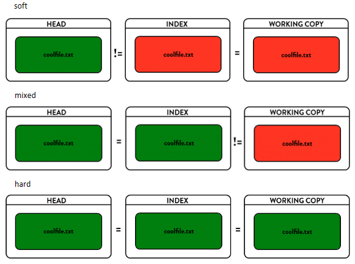

标识自己的名称，邮箱

```git
git congfig --global user.name "Okie"
git config --global user.email "666@qq.com"
```

### 创建仓库命令

下表列出了 git 创建仓库的命令：

| 命令          | 说明                                   |
| :------------ | :------------------------------------- |
| `git init`  | 初始化仓库                             |
| `git clone` | 拷贝一份远程仓库，也就是下载一个项目。 |

**创建ssh key:**

打开git bash，输入

```
ssh-keygen -t ed25519 -C "your_email@example.com"
```

提示输入秘钥名字和密码，为了方便起见，我这里选择不填

```
C:\Users\xxxx\Desktop\Git> ssh-keygen
Generating public/private rsa key pair.
Enter file in which to save the key (C:\Users\xxxx/.ssh/id_rsa): 
Enter passphrase (empty for no passphrase): 
Enter same passphrase again: 
Your identification has been saved in C:\Users\xxxx/.ssh/id_rsa.
Your public key has been saved in C:\Users\xxxx/.ssh/id_rsa.pub.
The key fingerprint is:
SHA256:PQqtJLnXe3WyERS/faU9DQgN8NU6cfZJwHUROfzm5j0 xxxx@xxxxxxxx
The key's randomart image is:
+---[RSA 3072]----+
|        ..oo++++=|
|         . o+++=.|
Receiving objects: 100% (6/6), done.</code></pre>
```

可以看到秘钥生成在 `C:\Users\xxxx/.ssh/`这个地方，文件名为 `id_rsa.pub`

将其放入自己github账户的sshkey中

### 提交与修改

Git 的工作就是创建和保存你的项目的快照及与之后的快照进行对比。

下表列出了有关创建与提交你的项目的快照的命令：

| 命令                                  | 说明                                     |
| :------------------------------------ | :--------------------------------------- |
| `git add`                           | 添加文件到暂存区                         |
| `git status`                        | 查看仓库当前的状态，显示有变更的文件。   |
| `git diff`                          | 比较文件的不同，即暂存区和工作区的差异。 |
| `git commit`                        | 提交暂存区到本地仓库。                   |
| `git reset`                         | 回退版本。                               |
| `git rm`                            | 将文件从暂存区和工作区中删除。           |
| `git mv`                            | 移动或重命名工作区文件。                 |
| `git checkout`                      | 分支切换。                               |
| `git switch （Git 2.23 版本引入）`  | 更清晰地切换分支。                       |
| `git restore （Git 2.23 版本引入）` | 恢复或撤销文件的更改。                   |

**add:**

```
git add file1.txt file2.java
git add .  //添加所有修改的文件到暂存区
```

**commit:**

```
git commit -m "备注信息"
git commit -a 			 //可以省略git add
git commit -am "备注信息" //提交流程不繁琐
```

**reset:**

```
git reset --soft "版本"   //仅仅移动版本库HEAD指针，工作区不变，暂存区也不变
git reset --mixed “版本”  //mixed为默认，可以省略。移动HEAD指针，暂存区重置，本地文件不变。
git reset --hard "版本"   //移动HEAD指针，暂存区重置，工作区的文件变为指定版本的。

git reset "版本" file.txt  (不建议使用！)
```



> 回退单个文件：
>
> - git reset（回退暂存区的指定文件，工作区不变）(建议少用，多用restore)
>
> ```git
> git reset <commit_id> <file_path>
> ```
>
> 然后执行git status，会发现工作区没变化！暂存区有变化，提示需要进行git add和git commit，原因是git reset作用于文件时，只会修改暂存区。（版本库肯定无法修改，因为只回退了一个文件，其他的文件并没有回退，所以整个版本不能回退）
>
> - checkout
>
> ```
> git checkout "版本" -- file.txt //工作区和暂存区都会更新(建议少用，多用restore)
> ```
>
> - `restore(建议使用的方式)`
>
> ```
> git restore file.txt //回滚到最新版本
> git restore --source=版本 file.txt //回退到指定版本
> ```

**checkout:**`(checkout完全可以被restore和switch替代)`

```
git checkout <branch-name>  	  //切换分支
git checkout - 					  //切换到回前一个分支
git checkout -b <new-branch-name> //创建新分支并切换
```

```
git checkout "版本" -- file.txt   //恢复暂存区和工作区的文件到指定版本

git checkout tags/<tag-name> 
```

**restore:**

```
git restore file.txt                //回滚到当前暂存区中的版本
git restore --source=版本 file.txt  //回退到指定版本
git restore --staged file.txt      //撤销暂存区的文件
git restore -s 版本 -SW file.txt   //-s指定版本，-S表示--staged，-W表示--worktree
```

**switch:**

```
git switch 分支名     //切换分支
git switch -c 分支名  //创建新分支并切换
git switch -         //切换到回前一个分支
git branch           //查看可用分支和标签
```

**branch:**

```
git branch  //列出分支
git branch 分支名 //创建分支
git branch -d 分支名  //删除分支
git branch -b 分支名  //创建并切换分支
```

**tag:**

```
git tag //查看标签
git tag 标签名 版本  为某个版本创建标签
git tag -d 标签名  //删除标签
```

### 远程操作

| 命令           | 说明               |
| :------------- | :----------------- |
| `git remote` | 远程仓库操作       |
| `git fetch`  | 从远程获取代码库   |
| `git pull`   | 下载远程代码并合并 |
| `git push`   | 上传远程代码并合并 |

**remote:**

- `git remote`：列出当前仓库中已配置的远程仓库。
- `git remote -v`：列出当前仓库中已配置的远程仓库，并显示它们的 URL。
- `git remote add <remote_name> <remote_url>`：添加一个新的远程仓库。指定一个远程仓库的名称和 URL，将其添加到当前仓库中。
- `git remote rename <old_name> <new_name>`：将已配置的远程仓库重命名。
- `git remote remove <remote_name>`：从当前仓库中删除指定的远程仓库。
- `git remote set-url <remote_name> <new_url>`：修改指定远程仓库的 URL。
- `git remote show <remote_name>`：显示指定远程仓库的详细信息，包括 URL 和跟踪分支。

**fetch:**

- `git fetch [remote]`：获取服务器所有变动

**pull:**

- `git pull [remote] [branch]`：获取远程仓库跟踪分支的变动，并合并到当前分支
- `git pull origin master:brantest`：将远程主机 origin 的 master 分支拉取过来，与本地的 brantest 分支合并。

**push:**

- `git push <远程主机名> <本地分支名>:<远程分支名>`：推送本地分支到远程分支（当前分支不能落后于远程分支，否则推送失败）
- `git push <远程主机名> <本地分支名>`：如果本地分支名与远程分支名相同，则可以省略冒号
- `git push -u <远程主机名> <本地分支名>`：-u表示跟踪远程分支，git pull时会默认拉取跟踪的分支
- `git push [remote] --all`：推送所有分支到远程仓库
