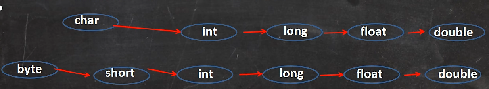
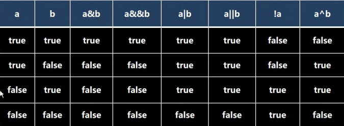
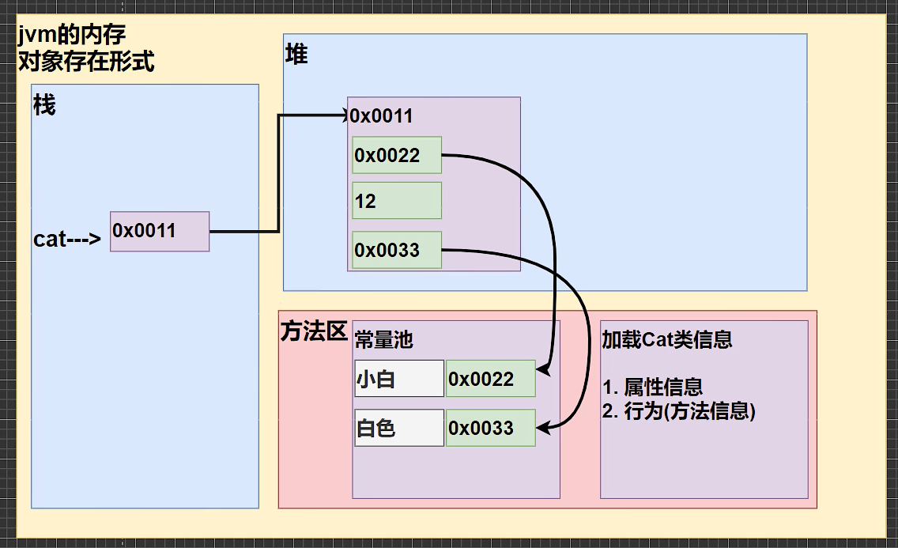
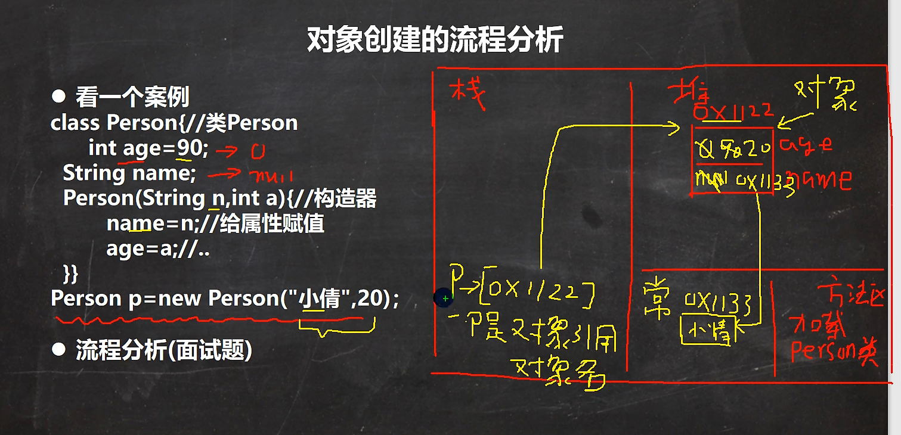
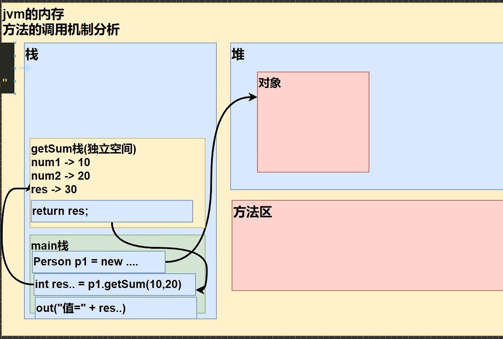
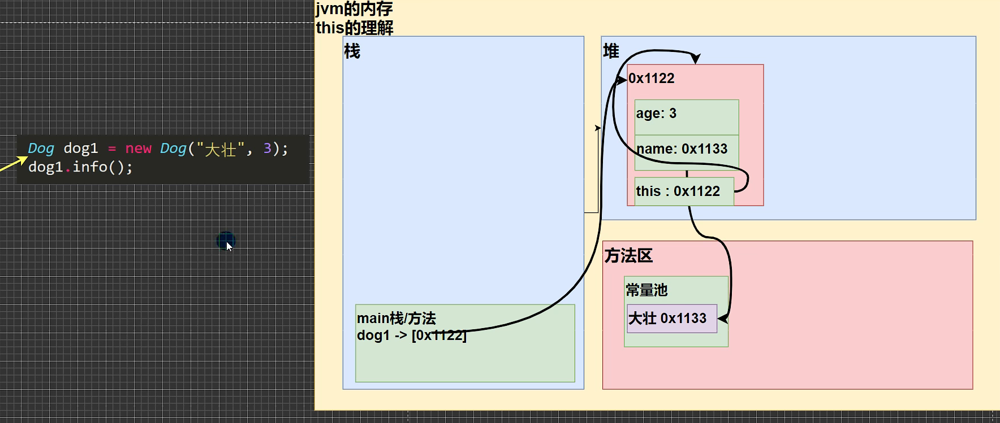

# 一、变量

变量表示内存中的一个存储区域

变量 = 变量名 + 值 + 数据类型

## 1、数据类型

基本数据类型是CPU可以直接进行运算的类型。Java定义了以下几种基本数据类型：

- 整数类型：byte，short，int，long
- 浮点数类型：float，double
- 字符类型：char      （`char`类型使用单引号`'`，且仅有一个字符）
- 布尔类型：boolean

不同的数据类型占用的字节数不一样。我们看一下Java基本数据类型占用的字节数：

```ascii
       ┌───┐
  byte │     │
       └───┘
       ┌───┬───┐
 short │     │     │
       └───┴───┘
       ┌───┬───┬───┬───┐
   int │     │     │     │     │
       └───┴───┴───┴───┘
       ┌───┬───┬───┬───┬───┬───┬───┬───┐
  long │     │     │     │     │     │     │     │     │
       └───┴───┴───┴───┴───┴───┴───┴───┘
       ┌───┬───┬───┬───┐
 float │     │     │     │     │
       └───┴───┴───┴───┘
       ┌───┬───┬───┬───┬───┬───┬───┬───┐
double │     │     │     │     │     │     │     │     │
       └───┴───┴───┴───┴───┴───┴───┴───┘
       ┌───┬───┐
  char │     │     │
       └───┴───┘
```

- byte：-128 ~ 127
- short: -32768 ~ 32767
- int: -2147483648 ~ 2147483647
- long: -9223372036854775808 ~ 9223372036854775807

`float`类型可最大表示3.4x10^38^，而`double`类型可最大表示1.79x10^308^


### 浮点型细节

对于运算结果是小数时，结果不准确。例如：8.1/3 = 2.6999999999999997

不能直接判断`8.1/3 == 2.7`，应该判断两个数差值的绝对值是否在某个精度范围内:

```java
if (Math.abs(2.7 - 8.1/3) < 0.001) {
	System.out.println("他们相等")
}
```

总结：

-  查询或赋值的小数可以直接判断相等
- 计算的小数需要判断差的绝对值是否在某个范围精度内


### 字符型细节

char是用`''`单引号，一个char存放一个字符。

char本质是整型，输出时，是unicode码对应的字符

char可以运算，相当于整数。


### var关键字

如果想省略变量类型，可以使用`var`关键字：

```
var sb = new StringBuilder();
```

编译器会根据赋值语句自动推断出变量`sb`的类型是`StringBuilder`。


## 2、类型转换

### 自动类型转换

- 多种类型的运算，系统首先将所有数据转换成容量最大的那种数据，然后再计算。**（三元运算符也算一种运算，容易忽略）**

- 精度（容量）小的可以自动转成精度大的，反之报错。
- （byte、short）char不能相互转换
- **一个细节：**byte、short、char可以运算，运算时先转换成int型！




### 强制类型转换

强制转换将大数据类型转为小数据类型，可能会丢失精度，可能数据溢出。

**细节：**char可以保存int常量，但不能赋值一个int变量。需要强转


### String和基本类型转换

- 基本类型转String：
  - `基本类型 + ""`即可
  - `包装类.toString()`静态方法
  - `String.valueOf()`静态方法
- String转基本类型：
  - `包装类.parseXX("字符串")`静态方法
  - `Integer.valueof()`静态方法
- String转char型：`字符串.charAt(0)`  参数写字符串下标

转换格式不对抛出异常

## 3、运算符

逻辑运算符一览
分为两组

1. 短路与 && ， 短路或 ||，取反 !
2. 逻辑与 &，逻辑或 |，^ 逻辑异或
   

**&& 和 & 使用区别**

1. &&短路与：如果第一个条件为 false，则第二个条件不会判断，最终结果为 false，效率高
2. & 逻辑与：不管第一个条件是否为 false，第二个条件都要判断，效率低
3. 开发中， 我们使用的基本是使用短路与&&, 效率高

**4.4.8 || 和 | 使用区别**

1. || 短路或：如果第一个条件为 true，则第二个条件不会判断，最终结果为 true，效率高
2. | 逻辑或：不管第一个条件是否为 true，第二个条件都要判断，效率低
3. 开发中，我们基本使用 ||


## 4、标识符规则与规范

### 命名规则

概念：

1. Java对各种变量、方法和类等命名时使用的字符序列称为标识符。
2. 凡是自己可以取名的地方就叫标识符。

标识符规则：

1. 由`26个英文字母大小写`、`0-9`、`_`或`$`组成（也可以是汉字、日文）。
2. 数字不能开头。
3. 不能使用关键字和保留字，但可以保函关键字和保留字。
4. Java中严格区分大小写，长度无限制。
5. 标识符不能包含空格

### 规范

1. 包名：多单词组成时所有字母都小写：aaa.bbb.ccc  //比如com.hsp.crm
2. 类名、接口名：多单词组成时，所有单词的首字母大写：XxxYyyZzz   //比如TankShotGame
3. 变量名、方法名：多单词组成时，第一个单词首字母小写，后面单词首字母大写：xxxYyyZzz
4. 常量名：所有字母都大写。多单词时用`_`连接：XXX_YYY_ZZZ


# 二、流程控制

## switch细节

1. 表达式数据类型，应和case后的常量类型一直，或者是可以自动转成可以相互比较的类型，比如输入的是字符，而常量是int
2. switch(表达式)中表达式的返回值必须是：（byte,short,int,char,enum,String）
3. case子句中的值必须是常量，而不能是变量
4. default子句是可选的，当没有匹配的case时，执行default
5. break语句用来执行完一个case分支后使程序跳出switch语句块；如果没有break，程序会顺序执行到switch结尾

## break和continue

`break`可以跳出当前循环。

`continue`语句可以提前结束本次循环；

# 三、数组排序和查找

## 1、数组基本内容

```java
int[] a = new int[5];
int a[] = new int[5];
int a[] = {12,13,14,15};
```

注意事项：

- 数组时多个相同类型数据的组合，对数据同一管理。注意，比如Double[]类型数组可以放int，原因是基本数据类型的自动转换。
- 数组中元素可以时任何类型，包括基本类型和引用类型，但不能混用。
- 数组创建后，如果没有赋值，有默认值！int = 0、short = 0、long = 0L、float = 0.0、double = 0.0、char = /u0000、boolean = false、String = null
- 数组时引用类型，数组型数据是对象（Object）

## 2、数组的使用

### 1.数组拷贝

#### 循环拷贝

```java
int[] arr1 = {1,2,3,4};
int[] arr2 = new int[arr1.length];

for (int i = 0;i < arr1.length;i++) {
	arr2[i] = arr1[i];
}
```

#### System.arraycopy

```java
System.arraycopy(Object src,int srcIndex,Object dest,int destIndex,int length)
```

1. src：源数组；
2. scrIndex：源数组起始索引；
3. dest：目标数组；
4. destIndex：目标起始索引；
5. length：复制源数组元素的个数

#### Arrays.copyOf

```java
int[] dest = Arrays.copyOf(int[] src, int newLength)
```

1. src：源数组
2. newLength：新数组长度

#### Arrays.copyOfRange

```java
Arrays.copyOfRange(dataType[] srcArray,int startIndex,int endIndex)
```

1. srcArray：源数组
2. startIndex：开始索引
3. endIndex：结束索引（不包括自己）

#### Object.clone

```java
Car[] arr2 = arr1.clone();
```

clone对数组也是浅拷贝

### 2.数组排序

#### Arrays.sort(升序)

```java
Arrays.sort(ns);
```

Arrays.fill    Arrays.toString

# 四、类与对象

- 类是抽象的，代表一个数据类型

- 对象是具体的，是实例



对象创建的流程分析：

1. 先加载Person类的`Class实例（专门保存类型的全部信息）`

2. 在堆内存开辟一块空间

3. 初始化对象：

   1. 进行默认初始化（刚开辟的空间 age = 0 赋值为 age = 90）

   2. 构造器初始化对象（将默认的 age = 90 改为 age = 20）



## 1、属性

1. 属性也叫`成员变量`也叫`Field（字段）`，访问修饰符 + 数据类型 + 属性名
2. 属性不赋值，会有默认值。规则和数组一样

3. 属性（成员变量）是全局作用域。可以在本类是使用，或其他类使用

## 2、方法

方法将结构信息存储在方法区，方法中隐含着this参数。**方法调用时，参数传递不是值或引用传递，而是创建对象副本的方式传递**

方法调用机制：

1. 程序执行到方法，会开辟一个独立空间（栈空间）
2. 方法执行完或return后，就会返回
3. 返回调用方法的地方，继续执行后面代码



方法重载：方法名必须相同；参数类型、个数或顺序至少一个不同

可变参数：必须放在最后，可以接收0或任意多个参数，可以接受数组（本质就是数组）

## 3、作用域

变量主要分为：成员变量（全局变量）和局部变量

- 全局变量：可以在本类中使用，或在其他类中使用
- 局部变量：只能在代码块中使用

## 4、构造器

构造器又叫构造方法，是类的一种特殊方法（可以重载），它的主要作用是完成对新对象的初始化

- 构造器方法名和类名要一致
- 没有返回值
- 创建对象时，系统自动调用构造器完成对象的初始化（构造器不会创建对象，只是完成对象的初始化）

##  5、this

创建对象时，对象有一个要隐藏的this，它的值就为对象自己在内存的地址。

this关键字**调用本类属性、调用本类方法、表示当前对象**



**细节：**

- this可以访问本类的属性`this.name`
- this可以实例的方法`this.info()`，和直接用本类的方法`info()`是有区别的
- this可以访问构造器。注意只能在构造方法中的第一条语句使用，来访问另外一个构造器

## 6、访问修饰符(modifier)

修饰符可以修饰类中的属性和方法以及类，用于控制属性和方法的访问权限。

只有public和默认可以修饰类。

| 访问级别 | 访问修饰符 | 同类 | 同包 | 子类 | 不同包 |
| :------: | :--------: | :--: | :--: | :--: | :----: |
|   公开   |   public   |  √   |  √   |  √   |   √    |
|  受保护  | protected  |  √   |  √   |  √   |   ×    |
|   默认   | 没有修饰符 |  √   |  √   |  ×   |   ×    |
|   私有   |  private   |  √   |  ×   |  ×   |   ×    |

