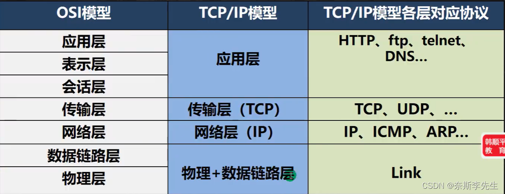
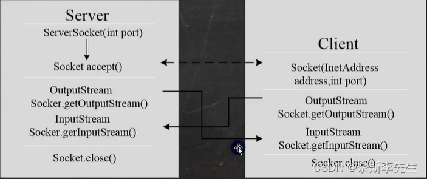

# 一、网络模型



**TCP和UDP**

- TCP协议（传输控制协议)

  ①  使用TCP协议前，须先建立TCP连接，形成传输数据通道；

  ②  传输前，采用“三次握手”方式，确认是可靠的；

  ③  TCP协议进行通信的两个应用进程：客户端、服务端；

  ④  在连接中可进行大数据量的传输；

  ⑤  传输完毕，需释放已建立的连接，效率低。

- UDP协议（用户数据协议）

  ①  将数据、源、目的封装成数据包，不需要建立连接；

  ②  因无需连接，故是不可靠的；

  ③  每个数据报的大小限制在64K内，不适合传输大量数据；

  ④  发送数据结束时无需释放资源（因为不是面向连接的），速度快；

  ⑤  举例：测试通知：发短信。

# 二、 InetAddress类

| 方法           | 作用                          |
| :------------- | :---------------------------- |
| getLocalHost   | 获取本机InetAddress对象       |
| getByName      | 根据指定主机名/域名获取ip对象 |
| getHostName    | 获取InetAddress对象的主机名   |
| getHostAddress | 获取InetAddress对象的地址     |

# 三 、Socket套接字

## 1、基本介绍

（1）套接字（Socket）开发网络应用程序被广泛采用，以至于成为事实上的标准；

（2）通讯的两端都要有Socket，是两台机器之间的通讯端点；

（3）网络通信其实就是Socket间的通信；

（4）Socket允许程序把网络连接当成一个流，数据在两个Socket间通过IO传输；

（5）一般主动发起通信的应用程序属于客户端，等待通信请求的为服务端。

## 2、TCP网络通信编程

基于客户端-服务端的网络通信；底层使用的是TCP/IP协议；



```java
//客户端
public class SocketTCP01Client {
    public static void main(String[] args) throws IOException {
        //1.链接服务端(IP,端口)，连接本机9999端口，可以指定对应的IP地址，如果连接成功则返回socket对象
        Socket socket = new Socket(InetAddress.getLocalHost(), 9999);
        //2.连接上后，生产socket，通过socket。getOutputStream()得到和socket对象关联的输出流对象
        OutputStream outputStream = socket.getOutputStream();
        //3.通过输出流，写入数据到数据通道
        outputStream.write("hello,server".getBytes());
        //设置结束标志,这样对方才能回复
        //在字符流中可以使用writer.newLine()写入结束标记，但对方需要使用readLine()
        socket.shutdownOutput();
        //4.关闭流对象和socket
        outputStream.close();
        socket.close();
        System.out.println("客户端结束");
    }
}

//服务端
public class SocketTCP01Server {
    public static void main(String[] args) throws IOException {
        //1.在本机的9999端口监听，等待链接，要求本机没有其他服务在监听9999端口
        //这个ServerSocket可以通过accept()返回多个Socket对象
        ServerSocket serverSocket = new ServerSocket(9999);
        //2.当没有客户端连接9999端口时，程序会阻塞，等待链接;如果有客户连接，则会返回Socket对象，程序继续
        Socket socket = serverSocket.accept();
        //3.通过socket.getInputStream()读取客户端写入到数据通道的数据，显示
        InputStream inputStream = socket.getInputStream();
        //4.IO读取
        byte[] buf = new byte[1024];
        int readLen = 0;
        while ((readLen = inputStream.read(buf)) != -1){
            System.out.println(new String(buf,0,readLen));//根据读取到的实际长度，显示内容
        }
        //5.关闭流和socket
        inputStream.close();
        socket.close();
        serverSocket.close();//关闭
    }
}
```

使用字符流：

```java
//Client类
/**
 * 客户端，发送 "hello, server" 给服务端， 使用字符流
 */
public class SocketTCP03Client {
    public static void main(String[] args) throws IOException {

        //1. 连接服务端 (ip , 端口）
        Socket socket = new Socket(InetAddress.getLocalHost(), 9999);
        //2. 连接上后，生成Socket, 通过socket.getOutputStream()得到 和 socket对象关联的输出流对象
        OutputStream outputStream = socket.getOutputStream();
        //3. 通过输出流，写入数据到 数据通道, 使用字符流
        BufferedWriter bufferedWriter = new BufferedWriter(new OutputStreamWriter(outputStream));
        bufferedWriter.write("hello, server 字符流");
        bufferedWriter.newLine();//插入一个换行符，表示写入的内容结束, 注意，要求对方使用readLine()!!!!
        bufferedWriter.flush();// 如果使用的字符流，需要手动刷新，否则数据不会写入数据通道
 
 
        //4. 获取和socket关联的输入流. 读取数据(字符)，并显示
        InputStream inputStream = socket.getInputStream();
        BufferedReader bufferedReader = new BufferedReader(new InputStreamReader(inputStream));
        String s = bufferedReader.readLine();
        System.out.println(s);
 
        //5. 关闭流对象和socket, 必须关闭
        bufferedReader.close();//关闭外层流
        bufferedWriter.close();
        socket.close();
        System.out.println("客户端退出.....");
    }
}
```

```java
//Server类
/**
 * 服务端, 使用字符流方式读写
 */
public class SocketTCP03Server {
    public static void main(String[] args) throws IOException {

        //1. 在本机 的9999端口监听, 等待连接
        //   细节: 要求在本机没有其它服务在监听9999
        //   细节：这个 ServerSocket 可以通过 accept() 返回多个Socket[多个客户端连接服务器的并发]
        ServerSocket serverSocket = new ServerSocket(9999);
        System.out.println("服务端，在9999端口监听，等待连接..");
        //2. 当没有客户端连接9999端口时，程序会 阻塞, 等待连接
        //   如果有客户端连接，则会返回Socket对象，程序继续
 
        Socket socket = serverSocket.accept();
 
        System.out.println("服务端 socket =" + socket.getClass());
        //
        //3. 通过socket.getInputStream() 读取客户端写入到数据通道的数据, 显示
        InputStream inputStream = socket.getInputStream();
        //4. IO读取, 使用字符流, 老师使用 InputStreamReader 将 inputStream 转成字符流
        BufferedReader bufferedReader = new BufferedReader(new InputStreamReader(inputStream));
        String s = bufferedReader.readLine();
        System.out.println(s);//输出
 
        //5. 获取socket相关联的输出流
        OutputStream outputStream = socket.getOutputStream();
        BufferedWriter bufferedWriter = new BufferedWriter(new OutputStreamWriter(outputStream));
        bufferedWriter.write("hello client 字符流");
        bufferedWriter.newLine();// 插入一个换行符，表示回复内容的结束
        bufferedWriter.flush();//注意需要手动的flush
 
 
        //6.关闭流和socket
        bufferedWriter.close();
        bufferedReader.close();
        socket.close();
        serverSocket.close();//关闭
 
    }
}
```

## 3、UDP网络通信编程

​	

```java
//UDP接收端
public class UDPReceiverA {
    public static void main(String[] args) throws IOException {
        //1.创建一个DatagramSocket对象，准备在9999接收数据
        DatagramSocket socket  = new DatagramSocket(9999);
        //2.构建一个DatagramPacket对象，准备接收数据,数据包最大64k
        byte[] buf = new byte[1024];
        DatagramPacket packet = new DatagramPacket(buf, buf.length);
        //3.调用接收方法，准备接收数据，将数据填充到packet中
        socket.receive(packet);
        //4.将packet进行拆包，取出数据并显示
        int length = packet.getLength();//获取实际接收到的长度
        byte[] data = packet.getData();//实际上的数据
        String s = new String(data, 0, length);
        System.out.println(s);
        //5.关闭资源
        socket.close();
    }
}

//UDP发送端
public class UDPSenderB {
    public static void main(String[] args) throws IOException {
        //1.创建DatagramSocket对象，准备在9998接收数据
        DatagramSocket socket = new DatagramSocket(9998);
        //2.将需要发送的数据封装到DatagramPacket对象，使用ipconfig查询ip地址
        byte[] data = "hello,明天吃火锅~".getBytes();
        DatagramPacket packet = new DatagramPacket(data, data.length, InetAddress.getByName("192.168.116.1"), 9999);
        socket.send(packet);
        //3.关闭资源
        socket.close();
    }
}
```

