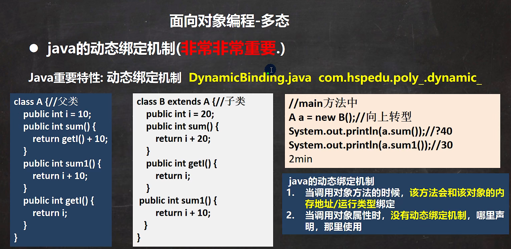

面向对象编程有三大特性：封装、继承和多态

# 一、封装

封装就是把抽象出的数据[属性]和对数据的操作[方法]封装在一起，数据被保护在内部，程序的其他部分只有通过被授权的操作[方法]，才能对数据进行操作。

- 封装可以隐藏实现细节
- 可以对数据进行验证，保证安全合理

# 二、继承

## 1、继承介绍与细节

继承可以解决代码复用，当多个类存在相同的属性和方法时，可以从这些类中抽象出父类，在父类中定义这些相同的属性和方法，子类通过extends来继承父类的属性和方法（不会继承代码块）。

细节：

1. 子类的构造器必须调用父类构造器，完成父类初始化（默认编译器会在第一行自动写`super();`语句

2. 默认调用父类无参构造器，如果没有提供无参构造器，则必须用`super(参数)`指定使用父类的哪个构造器完成对父类的初始化工作。否则编译不会通过。

3. super()在使用时，必须在构造器第一行语句

4. super()和this() 都必须在第一行，因此两个方法不能在一个构造器

5. java所有类都是Object的子类，所以调用父类构造器会一直追溯到Object的构造器。
6. java中时单继承机制，子类最多继承一个父类（指直接继承）如何让A类继承B和C？答：【A继承B，B继承C】


⭐访问属性和方法规则查找关系：

1. 先看本类是否有该属性：
   - 有，可以访问，返回
   - 有，不能访问，报错！！！（不会再去查找父类了，直接报错！）
2. 本类没有就查找父类：
   - 有，可以访问，返回
   - 有，不能访问，报错！！！（不会再去查找父类了，直接报错！）
3. 一直找到Object父类还没访问成功该属性，就报错

## 2、继承本质

实例对象时：

1. 先顺序加载Object、GrandPa、Fatrher、Son类到内存方法区
2. 开辟堆空间
3. 初始化父类 >> 子类                                                                                                                                                                                                                                                                                                                                                                                                                                                                                                                                                                                                                                                                                                                                                                                                                                                                                                                                                                                                                                                                                                                                                                                                                                                                                                                                                                                                                                                                                                                                                                                                                                                                                                                                                                                                                                                                                                                                                                                                                                                                                                                                                                                                                                                                                                                                                                                                                                                          


## 3、方法重写

方法重写也叫方法覆盖，需要满足一下条件：

1. 子类方法的参数和方法名要完全一样。
2. 子类方法的返回类型必须是父类返回类型的`后代`或和父类一致，比如：
   - 父类：`public Object test(){...};`
   - 子类：`public String test(){...};`
3. 子类方法不能缩小父类方法的访问权限。
4. **子类不能重写private方法**
5. **private方法被子类继承时，这个方法只对父类可见，只能在父类中用！**

```java
class Father{
    private void eat(){
        System.out.println("father");
    }

    public static void main(String[] args) {
        Father a = new Son();
        a.eat();//输出father;
    }
}
class Son extends Father{
    public void eat(){
        System.out.println("son");
    }
}
```


## 4、super与this比较

super和this使用规则基本相同，但一个指向父类，一个指向本类


# 三、多态

## 1、多态基本介绍

方法和对象具有多种形态。是面对对象的第三大特征，多态是建立在封装和继承基础之上的。

## 2、多态的具体体现

1. 方法的多态

   重写和重载就体现多态

2. 对象的多态

   - 一个对象的编译类型和运行类型可以不一致
   - 编译类型在定义时，就确定了，不能改变
   - 运行类型是可以变化的
   - 编译类型看定义时 = 号的左边，运行类型看 = 号的右边

### ⭐多态细节！

- 向上转型
  1. 本质：父类类型的引用指向子类的实例对象
  2. 语法：父类类型  引用名  =  new  子类类型()
  3. 特点：编译阶段用父类类型，所以父类类型叫编译类型。运行阶段引用子类类型，所以子类类型叫运行类型。
  4. 注意：编译阶段不能访问子类特有成员，会在编译期报错。**先运行编译类型的属性和方法，但`子类重写了父类方法，会先调用子类重写的方法。`**
- 向下转型
  1. 语法：子类类型  引用名  =  （子类类型）父类引用
  2. 只强转引用地址的类型，不能真正强转堆中的实例对象
  3. 要求父类类型的地址引用必须指向要转的目标子类的实例对象
  4. 强转后，可以调用子类的所有成员

### ⭐动态绑定机制

#### 静态绑定

所有私有方法、静态方法、构造器及初始化方法<clinit>都是采用静态绑定机制。在编译器阶段就已经指明了调用方法在常量池中的符号引用，JVM运行的时候只需要进行一次常量池解析即可。

#### 动态绑定

类对象方法的调用必须在运行过程中采用动态绑定机制。

1. 首先，根据声明类型(编译类型)找到“合适”的方法。具体步骤如下：

   ① 如果能在声明类型中匹配到方法签名完全一样(参数类型一致)的方法，那么这个方法是最合适的。

   ② 在第①条不能满足的情况下，寻找可以“凑合”的方法。标准就是通过将参数类型进行自动转型之后再进行匹配。如果匹配到多个自动转型后的方法签名f(A)和f(B)，则用下面的标准来确定合适的方法：传递给f(A)方法的参数都可以传递给f(B)，则f(A)最合适。反之f(B)最合适 。

   ③ 如果仍然在声明类型中找不到“合适”的方法，则编译阶段就无法通过。

2. 然后，根据运行类型找到对应的方法表，从中确定具体的方法在内存中的位置。




# 四、其他

## 1、instanceof

instanceof比较操作符，用于判断对象的**运行类型**是否为Xxx类，或Xxx类的子类，返回布尔

## 2、Object类

### equals方法

1. equals是Object类中的方法，只能判断引用类型。

2. 默认判断的是地址是否相等，子类中往往重写该方法，用于判断内容是否相等。比如：Integer、String

### hashCode方法

1. 提高具有哈希结构的容器的效率
2. 两个引用，如果指向的是同一个对象，则哈希值肯定一样的
3. 两个引用，如果指向的不同对象，哈希值不一样
4. 哈希值主要根据地址号来的，不能完全将地址等价于哈希值

### toString方法

1. Object中的toString方法默认返回：全类名 + @ + 哈希值的十六进制

2. 子类往往重写toString方法，用于返回对象的属性信息

### finalize方法

1. 当对象被回收是，系统自动调用该对象的finalize方法。子类可以重写该方法，做一些资源释放的操作
2. 什么时候被回收：当某个对象没有任何引用时，JVM就认为这个对象是一个垃圾对象，会使用垃圾回收机制来销毁该对象，再销毁前，会先调用finalize方法。
3. 垃圾回收机制的调用是由系统决定的（GC算法），也可以通过System.gc()主动除法垃圾回收机制。
