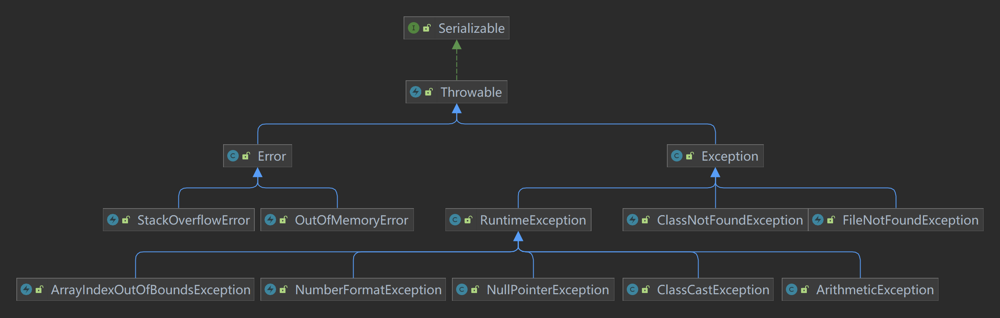

# 异常

## 1、异常介绍

Java语言中，将程序发生的不正常情况称为“异常”（开发过程的语法逻辑错误不是异常）

异常主要分为：

1. Error：Java虚拟机无法处理的严重异常
2. Exception：编程错误或偶然的外在因素导致的一般性问题，又细分为两种：
   - 编译异常：必须要自己进行异常处理
   - 运行时异常：默认自动进行throws处理

异常体系图：



## 2、异常处理

异常处理就是当异常发生时，对异常的处理方式，主要有两种方式。

### try-catch-finally

```java
try {
    f1();
} catch (RuntimeException e) {
    e.printStackTrace();
} catch (Exception e){
    e.printStackTrace();
} finally { //即使前面catch已经return了，finally也是必须执行的。
    System.out.println("释放资源");
}
```

### throws

```java
static void f1()throws Exception {
	throw new FileNotFoundException("文件没找到")
}
```

如果子类重写父类方法，子类throws的异常类型要能instanceof父类throws的异常类型

## 3、自定义异常

1. 自定义异常类，继承Exception或RuntimeException
2. 构造器执行父类构造器，表示异常信息。

```java
public class CustomException extends RuntimeException{
    public CustomException(String message) {
        super(message);
    }
}
```

## 4、throw和throws

|          |         意义         | 后面跟的东西 |      位置      |
| :------: | :------------------: | :----------: | :------------: |
| throws： |  是一种异常处理方式  | 抛出异常类型 | 放在方法声明处 |
| throw：  | 用来生成一个异常对象 |   异常对象   |   放在方法中   |

