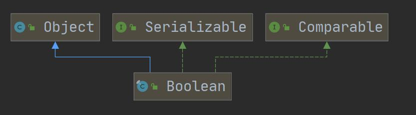
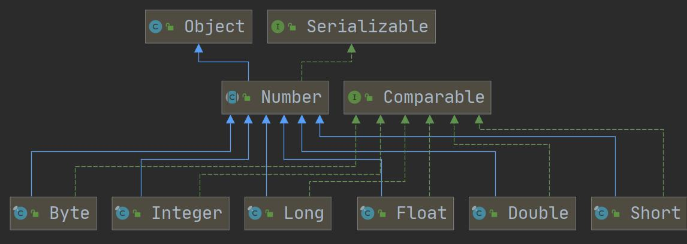
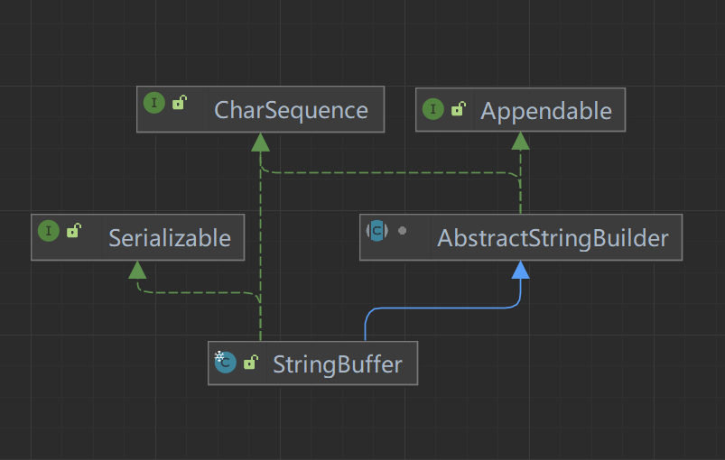

# 一、Wrapper包装类

## 1、八大Wrapper类

| 基本数据类型 |  包装类   |
| :----------: | :-------: |
|   boolean    |  Boolean  |
|     char     | Character |
|     byte     |   Byte    |
|    short     |   Short   |
|     int      |  Integer  |
|     long     |   Long    |
|    float     |   Float   |
|    double    |  Double   |

- Boolean和Char实现了Comparable和Serializable接口，继承自Object类
- 其他数字类型包装类都继承自Nubmer，实现Comparable接口。

|  |  |
| ------------------------------------------------------------ | ------------------------------------------------------------ |



## 2、包装类和基本类型

**①运算**

包装类和基本数据类型运算时，直接进行值运算

**②比较**

包装类和基本数据类型比较时，直接进行值比较

**③转换**

手动拆箱和装箱:

```java
//手动装箱
Integer i = Integer.valueOf(127);//-128~127的数字返回cache中的Integer对象
//手动拆箱
int i_ = i.intValue();
```

自动拆箱和装箱:

jdk ≥ 5后，上面的手动操作可以省略，可以自动进行拆箱和装箱

## 3、包装类和String转换

**①转成String**

```java
Integer i = 127
//转成String
String s1 = i + "";

String s2 = i.toString();

String s3 = String.valueOf(i);
```

**②转成包装类**

```java
String s = "a";
//转成包装类
Integer i1 = new Integer(s);

Integer i2 = Integer.parseInt(s);//返回int，再自动装箱

Integer i3 = Integer.valueOf(s);//注意-128~127缓存
```

# 二、String类⭐

## 1、介绍

- String对象用于保存字符串，也就是一组字符序列。
- 字符串常量对象用双引号括起来的字符序列。
- 字符串的字符用Unicode字符编码，一个字符占两字节。

## 2、创建

- 直接赋值：`String s = "abc"`  引用常量池的地址
- 调构造器：`String s = new String("abc")`  引用堆的地址
- 方法返回：`String s = String.valueOf(123)`  引用堆的地址

直接赋值的方式会先加入常量字符串到常量池中，再引用常量池中的字符串对象。

第二种方式先加入常量字符串到常量池中，之后在堆中创建对象，对象的value属性指向常量池字符串

第三种方式返回到堆中一个字符串对象，不会加入到常量池中（只有字符串常量才加入）。

**总之，只有出现字符串常量时，该常量才会加入常量池中**！

## 3、特性

1. s.intern方法：常量池中有该字符串，返回该字符串引用；没有则 

2. `String s = "aaa"+"bbb"`编译器会优化为`String s = "aaabbb"`

3. ```java
   String a = "aaa";
   String b = "bbb";
   String c = a + b;
   ```

   String变量对象相加时具体分析如下：

   ① 创建StringBuilder对象 `StringBuilder sb = new StringBuilder()`

   ② `sb.append(a)，sb.append(b)`

   ③ sb.toString() 返回堆中一个新String对象，且不加入常量池

## 4、方法

| equals              | 判断字符串是否相等                   |
| ------------------- | ------------------------------------ |
| equalsIgnoreCase    | 忽略大小写判断字符串是否相等         |
| length              | 获取字符串长度                       |
| indexOf(char c)     | 获取第一个该字符索引，找不到返回-1   |
| lastIndexOf(char c) | 获取最后一个该字符索引，找不到返回-1 |
| substring           | 截取字符串，包前不包后               |
| trim                | 去除前后空格                         |
| charAt(int i)       | 获取指定索引的字符                   |


| toUpperCase                 | 字母转换成大写                                               |
| --------------------------- | ------------------------------------------------------------ |
| toLowerCase                 | 字母转换成小写                                               |
| concat(String s)            | 拼接字符串                                                   |
| replace(String a，String b) | 将字符串中的b替换为a                                         |
| String[] split(String s)    | 以字符串s为分界进行切割，注意有些字符需要转义                |
| int compareTo(String s)     | 比较字符串大小。挨个字符相减，返回不为0的值，否则返回长度相减值 |
| toCharArray                 | 转换成字符数组                                               |
| format                      | 格式字符串：%s字符串、%d整数、%.2f两位小数、%c字符           |

# 三、可变字符串类

StringBuffer和StringBuilder都是可变字符串，并且两个类除了线程安全以外基本一样。



## 1、构造器

- StringBuffer()构造器默认创建的字符串value字符数组容量为16个字符。
- StringBuffer(int capacity)此构造器创建指定容量的字符串。
- StringBuffer(String str)创建的初始容量为str字符串长度+16

## 2、和String转换

**String转成StringBuffer**

```java
//方式一
StringBuffer sb1 = new StringBuffer("aaa");
//方式二
StringBuffer sb2 = new StringBuffer();
sb2.append("aaa");
```

**StringBuffer转成String**

```java
//方式一
String str1 = new String(sb1);
//方式二
String str2 = sb2.toString();
```

## 3、常用方法

1. 增append
2. 删delete(start, end)
3. 改replace(start, end, str)
4. 查indexOf(str)
5. 插insert(start, str)
6. length()

## 4、三个类比较

String、StringBuffer、StringBuilder

1. StringBuffer和StringBuilder两个类非常相似，都为可变字符串，且方法都一样。
2. String：value属性为final的，效率低，复用率高
3. StringBuffer：方法有synchronized修饰，效率高，线程安全
4. StringBuilder：效率最高，线程不安全

字符串不经常修改时用String，大量修改时用StringBuilder和SringBuffer，线程不安全用StringBuffer

# 四、Math类

Math类包含用于执行基本数学运算的方法，都是静态方法。

| Math.abs(number)               | 求绝对值                   |
| ------------------------------ | -------------------------- |
| double pow(double a, double b) | 求a的b次方                 |
| double ceil(double a)          | 向上取整，取≥a的double整数 |
| double floor(double a)         | 向下取整，取≤a的double整数 |
| int/long round(float/double)   | 四舍五入                   |
| double sqrt(double a)          | 求a的开方                  |
| double random()                | 求0~1的随机数，0≤a<1       |
| max(a，b)                      | 求两个数的最大值           |
| min(a，b)                      | 求两个数的最小值           |

# 五、Arrays

Arrays类包含一系列静态方法，用于管理和操作数组。

| toString              | 返回数组形式字符串                                     |
| --------------------- | ------------------------------------------------------ |
| sort(arr，comparator) | 进行升序自然排序；传入compare参数为定制排序            |
| binarySearch(arr)     | 二分法查询，返回索引。必须提前升序排好                 |
| copyOf(arr，length)   | 复制数组，length为复制的长度。调用的是System.arrayCopy |
| fill(arr，value)      | 数组填充                                               |
| equals                | 比较数组是否完全一致                                   |
| asList(T... a)        | 将数组转成ArrayList                                    |

```java
Integer[] arr = {2,4,1,5};

Arrays.sort(arr, new Comparator<Integer>() {
    @Override
    public int compare(Integer o1, Integer o2) {
        return o1 - o2;//升序;o2 - o1为降序
    }
});
```

# 六、System

| exit(0)                                       | 退出当前程序，0代表一个关闭状态                              |
| --------------------------------------------- | ------------------------------------------------------------ |
| arraycopy(src，srcPos，dest，destPos，length) | 复制数组，参数分别为源数组、源数组开始索引、目标数组、目标数组开始索引、需要复制的长度 |
| currentTimeMilis()                            | 返回当前时间距离1970-1-1的毫秒数                             |
| gc()                                          | 运行垃圾回收机制                                             |

# 七、BigInteger/Decimal

- BigInteger适合保存更大的整型
- BigDecimal适合保存精度更高的浮点型

| add                          | 加                                             |
| ---------------------------- | ---------------------------------------------- |
| subtract                     | 减                                             |
| multiply                     | 乘                                             |
| divide(bigDecimal，指定精度) | 除。BigDecimal调用此方法时，第二个参数指定精度 |

# 八、日期类

## 1、Date

第一代日期类，很多方法废弃了，但有些地方还是会使用到Date。

**①Date**

当前瞬时时间，可以传入毫秒数指定一个时间

**②SimpleDateFormat**

指定一个日期格式，主要用来转换Date类和String类

```java
Date d1 = new Date();//获取当前时间
Date d2 = new Date(632781l);//获取距离1970-1-1到指定毫秒的时间
String str2 = "1411年01月28日 21:15:44 星期六";

SimpleDateFormat sdf = new SimpleDateFormat("yyyy年MM月dd日 HH:mm:ss E");
String format = sdf.format(d1);//根据sdf的格式转换成String
Date parse = sdf.parse(str2);//根据sdf的格式转换成Date
```

## 2、Calendar

第二代日期类，Calendar为抽象方法，构造器是protected修饰的。它提供了大量日期时间的字段和操作方法。

```java
Calendar now = Calendar.getInstance();//调用静态方法获取实例

System.out.println(now.get(Calendar.YEAR));
System.out.println(now.get(Calendar.MONTH)+1);//月份从0开始
System.out.println(now.get(Calendar.DAY_OF_MONTH));
System.out.println(now.get(Calendar.HOUR_OF_DAY));//12制小时用HOUR
System.out.println(now.get(Calendar.MINUTE));
System.out.println(now.get(Calendar.SECOND));
//没有专门格式方法，需要程序员自己组合
```

Calendar的不足：

1. 可变性：日期类应该是不可变的。
2. 偏移性：Date年份是从1970开始的，Calendar月份从0开始。
3. 格式化：Calendar没有格式化
4. 此外，它们不是线程安全的，不能处理闰秒（每隔2年多1秒）

## 3、LocalDateTime

第三代日期（JDK8）：**LocalDate、LocalTime、LocalDateTime**

三个类都实现了ChronoLocalDateTime接口

```java
LocalDateTime ldt = LocalDateTime.now();

System.out.println(ldt.getYear());
System.out.println(ldt.getMonthValue());//getMonth为获取英文月份
System.out.println(ldt.getDayOfMonth());
System.out.println(ldt.getHour());
System.out.println(ldt.getMinute());
System.out.println(ldt.getSecond());
System.out.println(ldt.getDayOfWeek().getValue());//getDayOfWeek获取英文星期
```

```java
LocalDateTime localDateTime1 = ldt.plusYears(10);//增加日期时间
LocalDateTime localDateTime2 = ldt.minusDays(30);//减少日期时间
```

其他方法查阅API使用

**DateTimeFormat**：格式化日期类

```java
DateTimeFormatter dtf = DateTimeFormatter.ofPattern("yyyy-MM-dd HH:mm:ss E");
String s = dtf.format(ldt);
```

**Instant**：时间戳

```java
Instant now = Instant.now();
System.out.println(now);//2023-01-28T15:07:07.017Z

Date date = Date.from(now);
Instant instant = date.toInstant();
```
