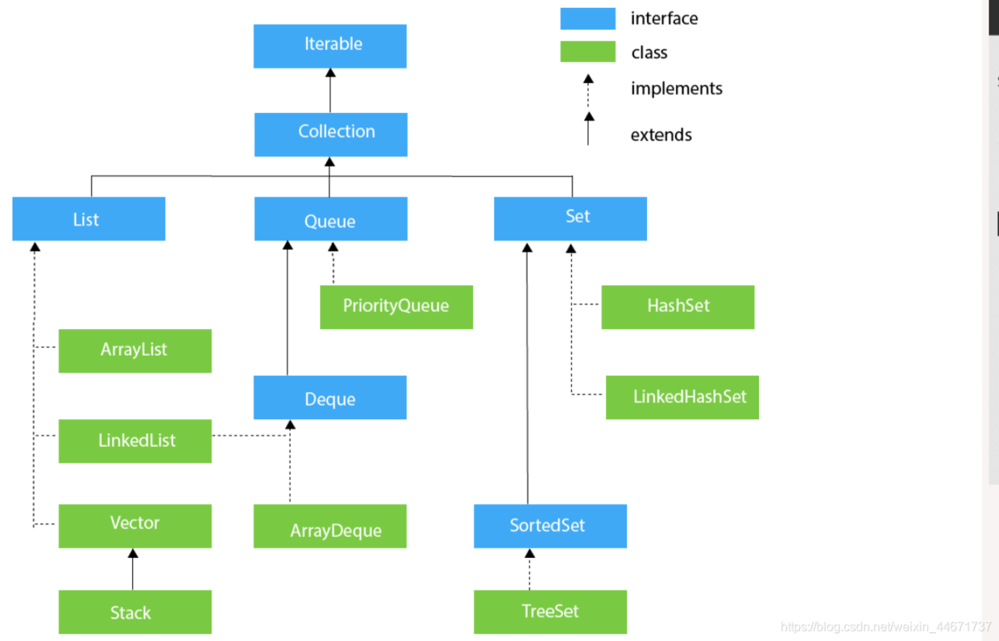
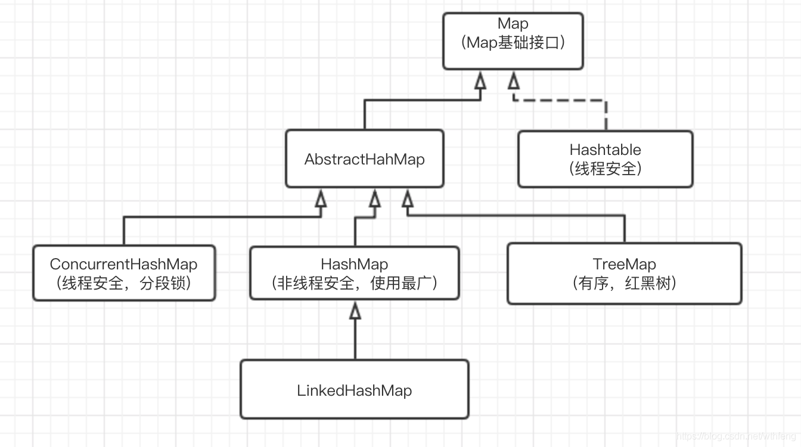
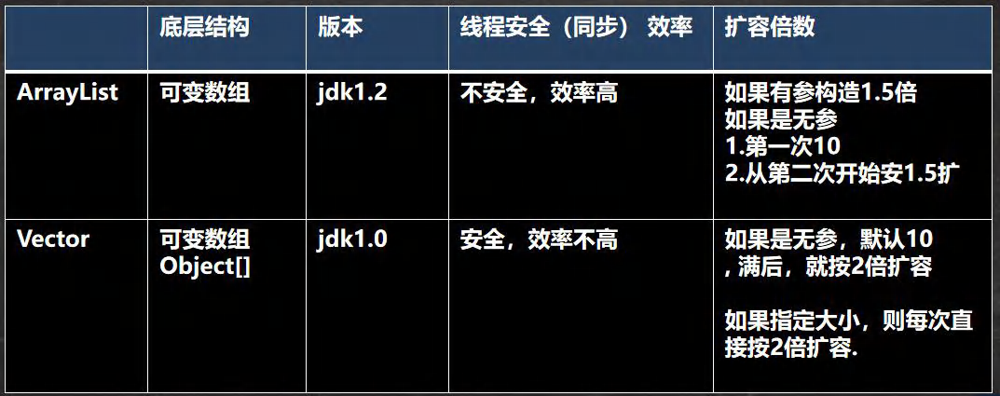
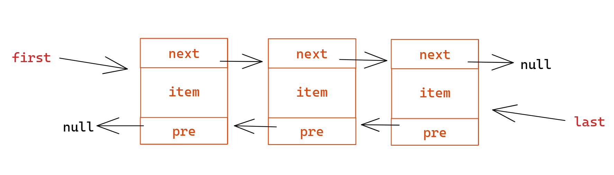

# 集合介绍与体系

Collection体系：



Map体系：



# 一、Collection

**Collection接口常用方法：**

| 方法                              | 描述             |
| --------------------------------- | ---------------- |
| add(E e)                          | 添加单个元素     |
| remove(E e)                       | 删除指定元素     |
| contains(E e)                     | 元素是否存在     |
| addAll(Collection<? extends E> c) | 添加多个元素     |
| removeAll(Collection<?> c)        | 删除多个元素     |
| containsAll(Collection<?> c)      | 是否存在多个元素 |
| size()                            | 元素个数         |
| isEmpty()                         | 是否为空         |
| clear()                           | 清空             |

**Collection两种遍历方式（本质是一种）：**

1. 使用Iterator（迭代器）

   ```java
   Iterator iterator = list.iterator();
   while (iterator.hasNext()) {
       Object next = iterator.next();
       //iterator.remove();
   }
   ```

2. 增强for（不能删除或添加元素）

   ```java
   for (Object o : list) {
       System.out.println(o);
   }
   ```

两种遍历集合时，无法修改集合元素，且添加或删除元素会报错。

## 1、List

List集合中的元素是有序的、可重复的、支持索引。

**常用方法：**

| add(int index, Object ele)          | 在index位置插入ele元素               |
| ----------------------------------- | ------------------------------------ |
| addAll(int index, Collection eles)  | 在index位置插入eles集合的元素        |
| get(int index)                      | 获取index位置的元素                  |
| indexOf(Object o)                   | 返回o元素第一次出现的位置            |
| remove(int index)                   | 移除index位置的元素，并返回          |
| set(int index, Object ele)          | 指定index位置的元素为ele             |
| subList(int fromIndex, int toIndex) | 返回从fromIndex到toIndex位置的子集合 |

遍历有三种方式：iterator、增强for、普通for

### Arraylist

1. ArrayList是由可变数组实现数据存储的。
2. 基本等同于Vector，但是线程不安全（执行效率高）

1. 无参构造器默认容量为0，第一次添加扩容为10，之后扩容为1.5倍。
2. 有参构造器指定容量，每次扩容为原来的1.5倍。

### Vector 

Vector和ArrayList基本一致为可变数组；

但它是线程安全的，Vector类的方法都由synchronized修饰；



### LinkedList

1. 底层数据结构是双链表；
2. 线程不安全，增删效率高，改查效率低；
3. LinkedList还实现了栈和队列的操作方法，可以作为栈、队列和双端队列来使用；



## 2、Set

Set接口是无序的，即添加和取出的顺序不一致(但是取出的顺序是固定的)，没有索引；不允许重复数据，使用最多只有一个null。

同Collection的迭代方式一样，因为Set接口是Collection接口的子接口，可以使用迭代器和增强for，但是不能使用索引的方式来获取。

### HashSet

第一次添加时，table扩容到16，临界值为容量*加载因子0.75为12。到达临界值后，会扩容2倍到32，因此新的临界值等于32乘以0.75=24，以此类推。还有一种导致扩容的情况是单条链已经超越TREEIFY-THRESHOLD(默认是8)，每超越一次，触发一次扩容。该容量是指元素的个数，不是只计算在第一个位置上的。

在添加数据时，先得到hash值，然后会转化为索引值，找到索引位置后判断是否已有元素，没有则直接加入，有则逐个调用equals方法比较，如果相同则放弃添加，否则将其添加到最后。在java8中，如果一条链表的元素个数超过TREEIFY-THRESHOLD(默认是8)，而且数组大小大于等于MIN-TREEIFY-CAPACITY(默认为64)，就会进行红黑树化。

### TreeSet

# 二、Map

Map用于具有映射关系的数据，key和value可以是任何引用类型的数据，会封装到HashMap$Node对象中。key不允许重复，但允许为null，而value允许重复，这种情况相当于进行替换。

### Map常用方法

| 方法        | 作用               |
| :---------- | :----------------- |
| put         | 添加               |
| remove      | 根据键删除映射关系 |
| get         | 根据键获取值       |
| size        | 获取元素个数       |
| isEmpty     | 判断是否为空       |
| clear       | 清除               |
| containsKey | 查找键是否存在     |
| keySet      | 获取所有的键       |
| entrySet    | 获取所有的关系     |
| values      | 获取所有的值       |

### HashMap

1. HashMap底层维护了Node[]数组table，默认为null

2. 创建对象时，将加载因子loadfactor初始化为0.75

3. 当添加key-val时，通过key的哈希值得到table的索引，然后判断该索引处是否有元素：

   - table为null时，初始化table[]，length为16、threshold为12

   - 没有元素，则直接添加
   - 有元素，则判断key的地址或内容（equals）是否相等：
     - 相等，则该元素的val替换为新val
     - 不相等，再判断Node是否为TreeNode（也就是是否树化）
       - 树化，则直接添加
       - 没树化，则遍历链表挨个判断每个元素是否相等，直到最后都不相等插入到链表最后。插入后判断树化阈值TREEIFY_THRESHOLD > 8：
         - 链表到达阈值则树化（table的容量没到64则停止树化，进行2倍扩容）
   - 最后判断table容量是否到达阈值(table.length * 0.75)，到达则扩容。

### HashTable

- 和HashMap很相似，它的key和valu都不能为Null
- Hashtable时线程安全的

### Properties

Properties继承自HashTable，使用特点和HashTable类似。

可以用于读取xx.properties文件

### 集合选型规则

