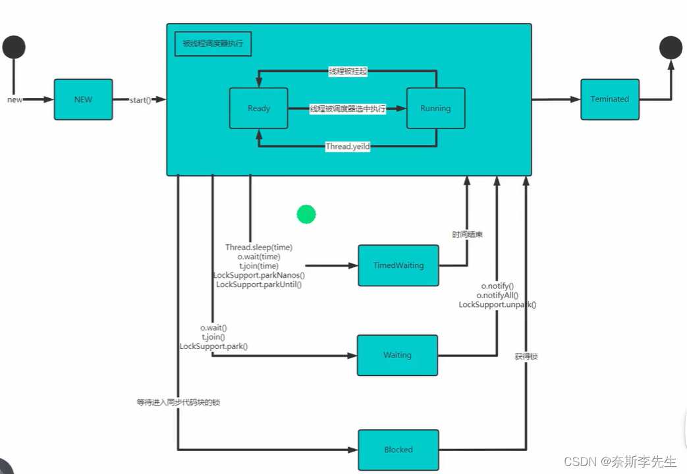

# 一、线程的使用
**在java中使用线程有两种方法，一种是继承Thread类，重写run方法；另一种是实行Runnable，重写run方法。**从java的设计来看，两者本质上没有区别，但实现Runnable接口方式更加适合多个线程共享一个资源的情况，并且避免了单继承的限制。

**为啥调用的是start方法，而不是run方法，因为run方法就是一个普通的方法，没有真正的启动一个线程，只是像以前一样顺序执行。线程是通过底层的start0方法实现的。**

当线程完成任务后会自动退出，除此之外还可以通过使用变量来控制run方法停止线程，即通知方式。

```java
public class Thread01 {
    public static void main(String[] args) {
    //1.继承Thread
        Cat cat = new Cat();
        cat.start();//启动线程，是start方法而不是run方法
    //2.实现Runnable接口
        Dog dog = new Dog();
        Thread thread1 = new Thread(dog);//设计模式中的代理模式
        Thread thread2 = new Thread(dog);//多个线程共享一个资源
        thread1.start();
        thread2.start();
        
        cat.setDaemon(true);//设置为守护线程
    }
}

class Cat extends Thread {
    int time = 0;
    @Override
    public void run() {//重写run方法，写上自己的业务逻辑
      synchronized(this){//给该代码块加锁
        while (time < 20) {
            System.out.println("我是西芹啊" + (++time));
            Thread.sleep(1000);//休眠1秒
        }
      }
    }
}
class Dog implements Runnable {
    int time = 0;
    @Override
    public void run() {
        System.out.println(time++);
    }
}
```

# 二、常用方法

| 方法        | 作用                                                         |
| :---------- | :----------------------------------------------------------- |
| setName     | 设置线程名称，使其与参数name相同                             |
| getName     | 返回线程的名称                                               |
| start       | 使该线程开始执行，java虚拟机底层调用该线程的start0方法       |
| run         | 调用线程对象run方法                                          |
| setPriority | 更改线程的优先级                                             |
| getPriority | 获取线程的优先级                                             |
| sleep       | 指定线程休眠的毫秒数                                         |
| interrupt   | 中断线程，一般用于中断正在休眠的线程，此时会进入catch方法中  |
| yield       | 线程的礼让，让出CPU使其他线程执行，但礼让的时间不确定，所以也不一定礼让成功 |
| join        | 线程的插队，插队的线程一旦插队成功，则肯定让先执行完插入的线程所有的任务 |
| getState    | 获取线程当前状态                                             |

# 三、线程的生命周期



| 生命周期      | 介绍                                                     |
| :------------ | :------------------------------------------------------- |
| NEW           | 尚未启动的线程                                           |
| RUNNABLE      | 在java虚拟机中执行的线程，可细分为READY和RUNNING两种状态 |
| BLOCKED       | 被阻塞等待监视器锁定的线程                               |
| WAITTING      | 正在等待另一个线程执行特定动作的线程                     |
| TIMED_WAITING | 正在等待另一个线程执行动作达到指定等待时间的线程         |
| TERMINATED    | 已退出的线程                                             |

# 四、Synchronized

可以加在**方法**和**方法内的代码块**上

#### （1）同步代码块

```java
//指定锁对象
public void get(){
    synchronized (this){//也可以是其他对象
        //需要被同步的代码
    }
}
//锁为类
public static void get(){
    synchronized (this){//this没用，锁会为类
        //需要被同步的代码
    }
}
```

#### （2）同步方法  

```java
//锁对象为this
public synchronized void m（String name）{
     //需要被同步的代码
}
//锁对象为当前类.class
public static synchronized void m（String name）{
     //需要被同步的代码
}
```
