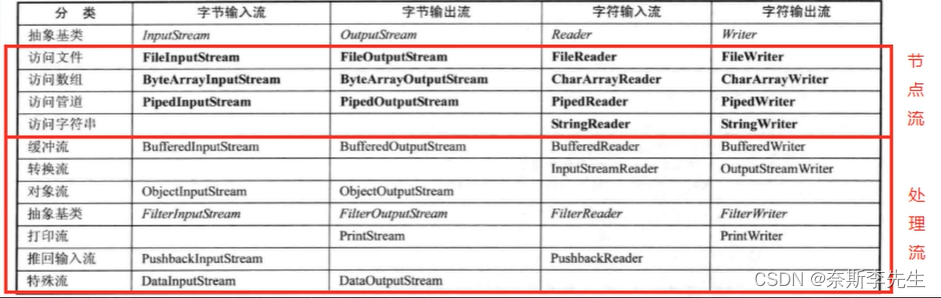

# 一、File

在java编程中，目录也被当作是一种文件。

### 常用构造方法

①  new File(String pathname) //根据路径构建一个File对象；

②  new File(File parent,String child) //根据父目录文件+子路径构建一个File对象；

③  new File(String parent,String child) //根据父目录+子路径构建一个File对象；

### 常用方法

| 方法            | 作用                 |
| :-------------- | :------------------- |
| getName         | 获取文件名称         |
| getAbsolutePath | 获取绝对路径         |
| getParent       | 获取文件父级目录     |
| length          | 文件大小，按字节统计 |
| exists          | 文件或目录是否存在   |
| isFile          | 是不是一个文件       |
| isDirectory     | 是不是一个目录       |
| mkdir           | 创建一级目录         |
| mkdirs          | 创建多级目录         |
| delete          | 删除空目录或文件     |
| createNewFile   | 创建文件夹           |
| close           | 关闭输入输出流       |

# 二、IO流

## 1、分类

（1）按照操作数据单位不同分为：字节流（8bit）【便于处理二进制文件】，字符流（按字符）【便于处理文本文件】；

（2）按数据流的流入不同分为：输入流，输出流；

（3）按流的角色的不同分为：节点流，处理流/包装流。




处理流（也叫包装流）是“连接”在已存在的流（节点流或处理流）之上，为程序提供更为强大的读写功能。

处理流（包装流）对节点流进行包装，使用了 修饰器设计模式，不会直接于数据源相连。

## 2、文件输入输出流

FileInputStream、FileOutputStream；FileReader、FileWriter

```java
void test3(){
        String srcFilePath = "e:\\Koala.jpg";
        String destFilePath = "e:\\Koala3.jpg";
        FileInputStream fileInputStream = null;
        FileOutputStream fileOutputStream = null;

        try {
            fileInputStream = new FileInputStream(srcFilePath);
            fileOutputStream = new FileOutputStream(destFilePath, true);//true代表追加模式
            //定义一个字节数组,提高读取效果
            byte[] buf = new byte[1024];
            int readLen = 0;
            while ((readLen = fileInputStream.read(buf)) != -1) {
                fileOutputStream.write(buf, 0, readLen);//一定要使用这个方法，
                //fileOutputStream.write(buf);如果有的不满一个数组的话，
                //就会出现将空的null也传过去，可能会出现打不开图片的情况。
            }
        } catch (IOException e) {
            e.printStackTrace();
        } finally {
            try {
                //关闭输入流和输出流，释放资源
                if (fileInputStream != null) {
                    fileInputStream.close();
                }
                if (fileOutputStream != null) {
                    fileOutputStream.close();
                }
            } catch (IOException e) {
                e.printStackTrace();
            }
        }

    }
```

## 3、缓冲流

BufferedInputStream、BufferedOutputStream；BufferedReader、BufferedWriter

```java
BufferedReader bufferedReader = null;
BufferedWriter bufferedWriter = null;
String readData;

try {
    bufferedReader = new BufferedReader(new FileReader("E://a.txt"));
    bufferedWriter = new BufferedWriter(new FileWriter("E://b.txt",true));
    while ((readData = bufferedReader.readLine()) != null){
        bufferedWriter.write(readData);
        bufferedWriter.write("\n");
    }
} catch (IOException e) {
    System.out.println(e.getMessage());
} finally {
    try {
        if(bufferedReader != null){
            bufferedReader.close();
        }
        if(bufferedWriter != null){
            bufferedWriter.close();
        }
    } catch (IOException e) {
        throw new RuntimeException(e);
    }
}
```

## 4、转换流

InputStreamWriter、OutputStreamWriter

可以将字节流包装成（转换）字符流；

```java
String filePath = "e:\\hsp.txt";
OutputStreamWriter osw = new OutputStreamWriter(new FileOutputStream(filePath), "utf-8");
osw.write("hi, 哈哈哈");
osw.close();
```

## 5、序列化流

ObjectInputStream、ObjectOutputStream

```java
public class ObjectOutStream_ {
    public static void main(String[] args) throws Exception {
        //序列化后，保存的文件格式，不是存文本，而是按照他的格式来保存
        String filePath = "e:\\data.dat";

        ObjectOutputStream oos = new ObjectOutputStream(new FileOutputStream(filePath));

        //序列化数据到 e:\data.dat
        oos.writeInt(100);// int -> Integer (实现了 Serializable)
        oos.writeBoolean(true);// boolean -> Boolean (实现了 Serializable)
        oos.writeChar('a');// char -> Character (实现了 Serializable)
        oos.writeDouble(9.5);// double -> Double (实现了 Serializable)
        oos.writeUTF("韩顺平教育");//String
        //保存一个dog对象
        oos.writeObject(new Dog("旺财", 10));
        oos.close();

    }
}
```

```java
public class ObjectInputStream_ {
    public static void main(String[] args) throws IOException, ClassNotFoundException {

        //指定反序列化的文件
        String filePath = "e:\\data.dat";

        ObjectInputStream ois = new ObjectInputStream(new FileInputStream(filePath));
        
        //1. 读取(反序列化)的顺序需要和你保存数据(序列化)的顺序一致否则会出现异常

        System.out.println(ois.readInt());
        System.out.println(ois.readBoolean());
        System.out.println(ois.readChar());
        System.out.println(ois.readDouble());
        System.out.println(ois.readUTF());

        //dog 的编译类型是 Object , dog 的运行类型是 Dog
        Object dog = ois.readObject();
        System.out.println("dog信息=" + dog);//底层 Object -> Dog
        
        ois.close();

    }
}
```


## 6、打印流

PrintStream、PrintWriter

```java
//PrintStream printStream = System.out  //这个printStream默认输出位置为显示器。
PrintStream printStream = new PrintStream("E://c.txt");
printStream.write("aaa".getBytes());
printStream.close();
```


```java
public class PrintWriter_ {
    public static void main(String[] args) throws IOException {

        //PrintWriter printWriter = new PrintWriter(System.out);
        PrintWriter printWriter = new PrintWriter(new FileWriter("e:\\f2.txt"));
        printWriter.print("hi, 北京你好~~~~");
        printWriter.close();//flush + 关闭流, 才会将数据写入到文件..

    }
}
```


## 7、标准输入输出流

|                     | 类型                             | 默认设备 |
| ------------------- | -------------------------------- | -------- |
| System.in 标准输入  | InputStream(BufferedInputStream) | 键盘     |
| System.out 标准输出 | PrintStream                      | 显示器   |


# 三、properties

```java
Properties properties = new Properties();
//1. 加载指定配置文件
properties.load(new FileReader("E://mysql.properties"));
//2. 复制到其他文件，顺序会变
properties.list(new PrintStream("E://mysql.properties.bak"));
//3. 根据key 获取对应的值
String user = properties.getProperty("user");
String pwd = properties.getProperty("pwd");
```

```java
Properties properties = new Properties();
properties.setProperty("charset", "utf8");
properties.setProperty("user", "汤姆");//注意保存时，是中文的 unicode码值
properties.setProperty("pwd", "888888");

//将k-v 存储文件中即可
//注意null是指properties配置文件没有要说明的注释，如果有的话会在配置文件的最上方显示。
properties.store(new FileOutputStream("E:\\mysql.properties"), null);
```
