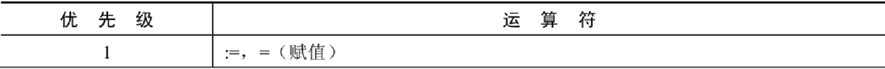

# 一、SQL分类和规则

## 1、SQL分类

**DDL（Date Definition Languages）数据定义语言**

**DML（Date Manipulation Languages）数据操作语言**

**DCL（Date Control Languages）数据控制语言**

## 2、规则与规范

1. 每条语句必须以`;`或`\g`或`\G`结束。
2. 字符串或日期类型的数据用单引号`''`表示。
3. 列的别名使用双引号`""`，而且不建议省略`AS`，表别名不加单引或双引号。
4. 数据库名、表名、表别名、字段名、字段别名等小写。
5. SQL关键字、函数、绑定变量等大写。

## 3、关键字

**AS**：设定表或列的别名，列别名建议加`""`，表别名要简洁且不加单引号和双引号。

​			AS可以省略

```sql
SELECT e.employee_id AS "id" FROM employees e WHERE e.employee_id>1;
```

**DISTINCT**：去除完全重复的行。

```sql
SELECT DISTINCT department_id FROM employees;
```

**DESCRIBE/DESC**：显示表结构。

```sql
DESCRIBE employees;
```

**WHERE**：将不符合条件的过滤掉。

> ​	*注意！！！where后的条件判断字符串时不区分大小写！*

```sql
SELECT id FROM employees WHERE name = 'Tom';#这里的Tom不区分大小写
```

# 二、运算符

## 1、算数运算符

**加减乘除：+		-		*		/(DIV)		%(MOD) **

- 有浮点型运算，结果转为浮点型
- 有字符型运算，先字符型转为数字型，转不成的看作0，然后运算
- 相除结果为保留4位小数
- 除以0结果为`null`

## 2、比较运算符


基本规则：

1. 数字型 和 字符型 比较，字符型转成数字型，转不了的看作`0`
2. 除了`<=>`，出现`NULL`时运算结果为`NULL`
3. 两边都为字符串，比较每个字符的ANSI编码。


LIKE：模糊匹配，`%`表示0~任意个字符,`_`表示一个字符

## 3、逻辑运算符


**XOR**：不会短路，只有一个为0一个为1时，结果才为1

## 4、位运算符


## 5、运算符优先级




数字编号越大，优先级越高，优先级高的运算符先进行计算。可以看到，赋值运算符的优先级最低，使用“()”括起来的表达式的优先级最高。

## 拓展：使用正则表达式查询

正则表达式通常被用来检索或替换那些符合某个模式的文本内容，根据指定的匹配模式匹配文本中符合要求的特殊字符串。例如，从一个文本文件中提取电话号码，查找一篇文章中重复的单词或者替换用户输入的某些敏感词语等，这些地方都可以使用正则表达式。正则表达式强大而且灵活，可以应用于非常复杂的查询。

MySQL中使用REGEXP关键字指定正则表达式的字符匹配模式。下表列出了REGEXP操作符中常用字符匹配列表。


**1. 查询以特定字符或字符串开头的记录**
字符‘^’匹配以特定字符或者字符串开头的文本。

在fruits表中，查询f_name字段以字母‘b’开头的记录，SQL语句如下：

```mysql
mysql> SELECT * FROM fruits WHERE f_name REGEXP '^b';
```

**2. 查询以特定字符或字符串结尾的记录**
字符‘$’匹配以特定字符或者字符串结尾的文本。

在fruits表中，查询f_name字段以字母‘y’结尾的记录，SQL语句如下：

```mysql
mysql> SELECT * FROM fruits WHERE f_name REGEXP 'y$';
```

**3. 用符号"."来替代字符串中的任意一个字符**
字符‘.’匹配任意一个字符。
在fruits表中，查询f_name字段值包含字母‘a’与‘g’且两个字母之间只有一个字母的记录，SQL语句如下：

```mysql
mysql> SELECT * FROM fruits WHERE f_name REGEXP 'a.g';
```

**4. 使用"*"和"+"来匹配多个字符**
星号‘*’匹配前面的字符任意多次，包括0次。加号‘+’匹配前面的字符至少一次。

在fruits表中，查询f_name字段值以字母‘b’开头且‘b’后面出现字母‘a’的记录，SQL语句如下：

```mysql
mysql> SELECT * FROM fruits WHERE f_name REGEXP '^ba*';
```

在fruits表中，查询f_name字段值以字母‘b’开头且‘b’后面出现字母‘a’至少一次的记录，SQL语句如下：

```mysql
mysql> SELECT * FROM fruits WHERE f_name REGEXP '^ba+';
```

**5. 匹配指定字符串**
正则表达式可以匹配指定字符串，只要这个字符串在查询文本中即可，如要匹配多个字符串，多个字符串之间使用分隔符‘|’隔开。

在fruits表中，查询f_name字段值包含字符串“on”的记录，SQL语句如下：

```mysql
mysql> SELECT * FROM fruits WHERE f_name REGEXP 'on';
```

在fruits表中，查询f_name字段值包含字符串“on”或者“ap”的记录，SQL语句如下：

```mysql
mysql> SELECT * FROM fruits WHERE f_name REGEXP 'on|ap';
```

之前介绍过，LIKE运算符也可以匹配指定的字符串，但与REGEXP不同，LIKE匹配的字符串如果在文本中间出现，则找不到它，相应的行也不会返回。REGEXP在文本内进行匹配，如果被匹配的字符串在文本中出现，REGEXP将会找到它，相应的行也会被返回。对比结果如下所示。

在fruits表中，使用LIKE运算符查询f_name字段值为“on”的记录，SQL语句如下：

```mysql
mysql> SELECT * FROM fruits WHERE f_name like 'on';
Empty set(0.00 sec)
```

**6. 匹配指定字符中的任意一个**
方括号“[]”指定一个字符集合，只匹配其中任何一个字符，即为所查找的文本。

在fruits表中，查找f_name字段中包含字母‘o’或者‘t’的记录，SQL语句如下：

```mysql
mysql> SELECT * FROM fruits WHERE f_name REGEXP '[ot]';
```

在fruits表中，查询s_id字段中包含4、5或者6的记录，SQL语句如下：

```mysql
mysql> SELECT * FROM fruits WHERE s_id REGEXP '[456]';
```

**7. 匹配指定字符以外的字符**
`“[^字符集合]”`匹配不在指定集合中的任何字符。

在fruits表中，查询f_id字段中包含字母a~e和数字1~2以外字符的记录，SQL语句如下：

```mysql
mysql> SELECT * FROM fruits WHERE f_id REGEXP '[^a-e1-2]';
```

**8. 使用{n,}或者{n,m}来指定字符串连续出现的次数**
“字符串{n,}”表示至少匹配n次前面的字符；“字符串{n,m}”表示匹配前面的字符串不少于n次，不多于m次。例如，a{2,}表示字母a连续出现至少2次，也可以大于2次；a{2,4}表示字母a连续出现最少2次，最多不能超过4次。

在fruits表中，查询f_name字段值出现字母‘x’至少2次的记录，SQL语句如下：

```mysql
mysql> SELECT * FROM fruits WHERE f_name REGEXP 'x{2,}';
```

在fruits表中，查询f_name字段值出现字符串“ba”最少1次、最多3次的记录，SQL语句如下：

```mysql
mysql> SELECT * FROM fruits WHERE f_name REGEXP 'ba{1,3}';
```

# 三、SELECT

```sql
SELECT (DISTINCT) */字段/常数 FROM 表名
```

## 1、常用关键字

**① AS**：设定表或列的别名，列别名建议加`""`，表别名要简洁且不加单引号和双引号。

​			AS可以省略

```sql
SELECT e.employee_id AS "id" FROM employees e WHERE e.employee_id>1;
```

**② DISTINCT**：去除完全重复的行。

```sql
SELECT DISTINCT department_id FROM employees;
```

**③ WHERE**：将不符合条件的过滤掉。

> ​	注意！！！where后的条件判断字符串时不区分大小写！
>
> ​	且WHERE语句后不能使用别名！

```sql
SELECT id,name AS n FROM employees WHERE name = 'Tom';
#这里的Tom不区分大小写,且不能用别名
```

**④ ORDER BY**：排序

descend：降序；ascend：升序；

```sql
SELECT id AS i FROM employees WHERE id > 3 ORDER BY i DESC;
```

**⑤ LIMIT**：分页

```sql
SELECT id AS i FROM employees  WHERE id>0 ORDER BY id LIMIT 0,10;
#0表示偏移量，从0条开始；10表示一页的数量；
```

oracle数据库没有LIMIT，需要使用ROWNUM:

```sql
-- 利用rownum 
-- rownum从0开始
select * from
(select rownum rr,stu.* from (select * from t_student order by sid desc) stu )
where rr>=1 and rr<=5;
```

## 2、多表查询


笛卡尔积：A、B两个集合相乘。

```sql
SELECT * FROM employees,departments;
```

正确的多表查询应该像下面这样 👇

```sql
SELECT * FROM employees e,departments d WHERE e.department_id = d.department_id;
```

**多表查询的分类：**

- 角度一：等值连接  VS  非等值连接

- 角度二：自连接  VS  非自连接
- 角度三：内连接  VS  外连接

### ① 等值连接

```sql
SELECT * FROM employees e,departments d WHERE e.department_id = d.department_id;
```

### ② 非等值连接

```sql
SELECT * FROM employees e,job_grades j WHERE e.salary BETWEEN j.lowest_sal AND j.highest_sal;
```

### ③ 自连接

```sql
SELECT * FROM employees e,employees m WHERE e.manager_id = m.employee_id;
```

### ④ 内连接

SQL92内连接：

```sql
SELECT * FROM employees e,employees m WHERE e.manager_id = m.employee_id;//SQL92语法的内连接
```

SQL99内连接

```sql
SELECT * FROM employees e /*INNER*/ JOIN departments d ON e.department_id = d.department_id;//SQL99语法的内连接,INNER可以省略
```

### ⑤ 外连接

SQL92外连接（Oracle支持，Mysql不支持）：

```sql
SELECT * FROM employees e,employees m WHERE e.manager_id = m.employee_id(+);//SQL92语法，employee为主表的左外连接。
```

SQL99外连接：

```sql
SELECT * FROM employees e LEFT /*OUTER*/ JOIN departments d ON e.department_id = d.department_id;//SQL99语法的左外连接,OUTER可以省略
```

> 满外连接FULL JOIN在Mysql中不支持 ，可以用UNION ALL实现：
>
> ```sql
> SELECT * FROM employees e 
> LEFT JOIN departments d ON e.department_id = d.department_id
> UNION ALL
> SELECT * FROM employees e
> RIGHT JOIN departments d ON e.department_id = d.department_id
> WHERE e.department_id IS NULL;
> ```

### ⑥ UNION

UNION：将两个集合和为一个集合，去除重复数据（效率低）

UNION ALL：将两个集合和为一个集合，不去除重复数据。

### 拓展

NATURAL：用来表示自然连接。我们可以把自然连接理解为 SQL92 中的等值连接。它会帮你自动查询两张连接表中`所有相同的字段`，然后进行`等值连接`。

```sql
SELECT employee_id,last_name,department_name
FROM employees e JOIN departments d
ON e.`department_id` = d.`department_id`
AND e.`manager_id` = d.`manager_id`;
```

SQL99可以写成下面这样：
```sql
SELECT * FROM employees e NATURAL JOIN departments d 
```

USING：当我们进行连接的时候，SQL99还支持使用 USING 指定数据表里的`同名字段`进行等值连接。

```mysql
SELECT employee_id,last_name,department_name
FROM employees e JOIN departments d
USING (department_id);
```

> 【强制】超过三个表禁止 join。需要 join 的字段，数据类型保持绝对一致；多表关联查询时， 保证被关联的字段需要有索引。 
>
> 说明：即使双表 join 也要注意表索引、SQL 性能。
>
> 来源：阿里巴巴《Java开发手册》

## 3、子查询

**子查询的分类：**

分类方式一：单行子查询、多行子查询

分类方式二：相关子查询、不相关子查询

### ① 单行子查询

**题目：查询最低工资大于50号部门最低工资的部门id和其最低工资**

```sql
SELECT   department_id, MIN(salary)
FROM     employees
GROUP BY department_id
HAVING   MIN(salary) >
                       (SELECT MIN(salary)
                        FROM   employees
                        WHERE  department_id = 50);
```

### ② 多行子查询

**多行比较操作符**

| 操作符 | 含义                                                         |
| ------ | ------------------------------------------------------------ |
| IN     | 等于列表中的**任意一个**                                     |
| ANY    | 需要和单行比较操作符一起使用，和子查询返回的**某一个**值比较 |
| ALL    | 需要和单行比较操作符一起使用，和子查询返回的**所有**值比较   |
| SOME   | 实际上是ANY的别名，作用相同，一般常使用ANY                   |

**题目：查询平均工资最低的部门id**

```mysql
SELECT department_id
FROM employees
GROUP BY department_id
HAVING AVG(salary) <= ALL (
				SELECT AVG(salary) avg_sal
				FROM employees
				GROUP BY department_id
)
```

**空值问题**

```mysql
SELECT last_name
FROM employees
WHERE employee_id NOT IN (
			SELECT manager_id
			FROM employees
			);
```


### ③ 关联子查询

**题目：查询员工的id,salary,按照department_name 排序**

```sql
SELECT employee_id,salary
FROM employees e
ORDER BY (
	  SELECT department_name
	  FROM departments d
	  WHERE e.`department_id` = d.`department_id`
	);
```

### ④ EXISTS

**题目：查询departments表中，不存在于employees表中的部门的department_id和department_name**

```sql
SELECT department_id, department_name
FROM departments d
WHERE NOT EXISTS (SELECT 'X'
                  FROM   employees
                  WHERE  department_id = d.department_id);
```

# 四、增删改

## 1. 插入数据

###  1.2 方式1：VALUES的方式

**为表的指定字段插入数据**

```mysql
INSERT INTO 表名(column1 [, column2, …, columnn]) 
VALUES (value1 [,value2, …, valuen]);
```

其他字段的值为表定义时的默认值。

VALUES中要插入的value1,....valuen需要与column1,...columnn列一一对应。如果类型不同，将无法插入，并且MySQL会产生错误。

举例：

```mysql
INSERT INTO departments(department_id, department_name)
VALUES (80, 'IT');
```

 **同时插入多条记录**

```mysql
INSERT INTO table_name(column1 [, column2, …, columnn]) 
VALUES 
(value1 [,value2, …, valuen]),
(value1 [,value2, …, valuen]),
……
(value1 [,value2, …, valuen]);
```

举例：

```mysql
mysql> INSERT INTO emp(emp_id,emp_name)
    -> VALUES (1001,'shkstart'),
    -> (1002,'atguigu'),
    -> (1003,'Tom');
Query OK, 3 rows affected (0.00 sec)
Records: 3  Duplicates: 0  Warnings: 0
```

使用INSERT同时插入多条记录时，MySQL会返回一些在执行单行插入时没有的额外信息，这些信息的含义如下：
●　Records：表明插入的记录条数。
●　Duplicates：表明插入时被忽略的记录，原因可能是这些记录包含了重复的主键值。
●　Warnings：表明有问题的数据值，例如发生数据类型转换。

> - `VALUES`也可以写成`VALUE`，但是VALUES是标准写法。
>
>
> - 字符和日期型数据应包含在单引号中。
>


### 1.3 方式2：查询结果插入

基本语法格式如下：

```mysql
INSERT INTO 目标表名
(tar_column1 [, tar_column2, …, tar_columnn])
SELECT
(src_column1 [, src_column2, …, src_columnn])
FROM 源表名
[WHERE condition]
```

- 在 INSERT 语句中加入子查询。 
- 子查询中的值列表应与 INSERT 子句中的列名对应。

举例：

```sql
INSERT INTO emp2 
SELECT * 
FROM employees
WHERE department_id = 90;
```

## 2. 更新数据

- 使用 UPDATE 语句更新数据。语法如下：

```sql
UPDATE table_name
SET column1=value1, column2=value2, … , column=valuen
[WHERE condition]
```

- 如果需要回滚数据，需要保证在DML前，进行设置：**SET AUTOCOMMIT = FALSE;**

```sql
UPDATE employees
SET    department_id = 70
WHERE  employee_id = 113;
```

- 如果省略 WHERE 子句，则表中的所有数据都将被更新。

```sql
UPDATE 	copy_emp
SET    	department_id = 110;
```

## 3. 删除数据

```mysql
DELETE FROM table_name [WHERE <condition>];
```

WHERE定删除条件，如果没有WHERE子句，DELETE语句将删除表中的所有记录。

- 使用 WHERE 子句删除指定的记录。

```sql
DELETE FROM departments
WHERE  department_name = 'Finance';
```

- 如果省略 WHERE 子句，则表中的全部数据将被删除

```sql
DELETE FROM  copy_emp;
```

## 4. MySQL8新特性：计算列

什么叫计算列呢？简单来说就是某一列的值是通过别的列计算得来的。例如，a列值为1、b列值为2，c列不需要手动插入，定义a+b的结果为c的值，那么c就是计算列，是通过别的列计算得来的。

在MySQL 8.0中，CREATE TABLE 和 ALTER TABLE 中都支持增加计算列。下面以CREATE TABLE为例进行讲解。

举例：定义数据表tb1，然后定义字段id、字段a、字段b和字段c，其中字段c为计算列，用于计算a+b的值。
首先创建测试表tb1，语句如下：

```mysql
CREATE TABLE tb1(
id INT,
a INT,
b INT,
c INT GENERATED ALWAYS AS (a + b) VIRTUAL
);
```

插入演示数据，语句如下：

```mysql
INSERT INTO tb1(a,b) VALUES (100,200);
```

查询数据表tb1中的数据，结果如下：

```mysql
mysql> SELECT * FROM tb1;
+------+------+------+------+
| id   | a    | b    | c    |
+------+------+------+------+
| NULL |  100 |  200 |  300 |
+------+------+------+------+
1 row in set (0.00 sec)
```

更新数据中的数据，语句如下：

```mysql
mysql> UPDATE tb1 SET a = 500;
Query OK, 0 rows affected (0.00 sec)
Rows matched: 1  Changed: 0  Warnings: 0
```

