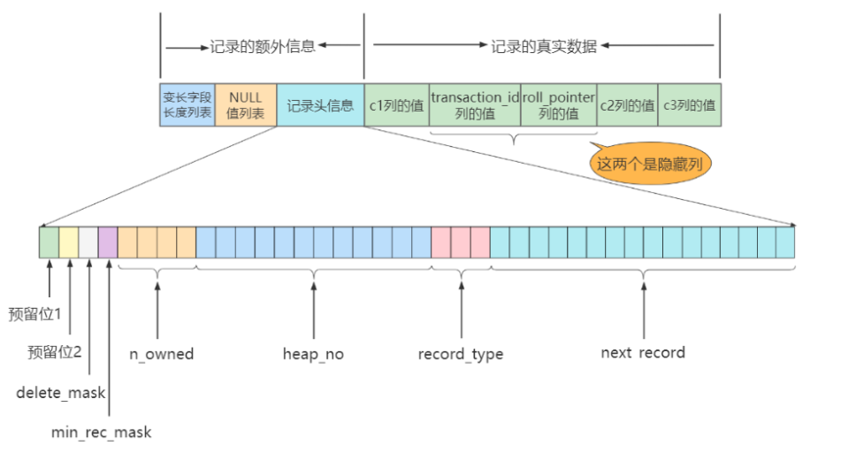

# 一、Mysql逻辑架构

## 1. 逻辑架构剖析


**SQL执行流程：**

- 连接器：建立连接，管理连接、校验用户身份；
- 查询缓存：查询语句如果命中查询缓存则直接返回，否则继续往下执行。MySQL 8.0 已删除该模块；
- 解析 SQL，通过解析器对 SQL 查询语句进行词法分析、语法分析，然后构建语法树，方便后续模块读取表名、字段、语句类型；
- 执行 SQL：执行 SQL 共有三个阶段：
  - 预处理阶段：检查表或字段是否存在；将 `select *` 中的 `*` 符号扩展为表上的所有列。
  - 优化阶段：基于查询成本的考虑， 选择查询成本最小的执行计划；
  - 执行阶段：判断该用户是否`具备权限`，再根据执行计划执行 SQL 查询语句，从存储引擎读取记录，返回给客户端；

### 1.1 第1层：连接层

系统（客户端）访问`MySQL`服务器前，做的第一件事就是建立`TCP`连接。

经过三次握手建立连接成功后，`MySQL`服务器对`TCP`传输过来的账号密码做身份认证、权限获取。

- **用户名或密码不对，会收到一个Access denied for user错误，客户端程序结束执行**
- **用户名密码认证通过，会从权限表查出账号拥有的权限与连接关联，之后的权限判断逻辑，都将依赖于此时读到的权限**

### 1.2 第2层：服务层

- **SQL Interface: SQL接口**

  - 接收用户的SQL命令，并且返回用户需要查询的结果。比如SELECT … FROM就是调用SQL Interface
  - MySQL支持DML（数据操作语言）、DDL（数据定义语言）、存储过程、视图、触发器、自定义函数等多种SQL语言接口

- **Parser:** **解析器**

  - 在解析器中对 SQL 语句进行语法分析、语义分析。将SQL语句分解成数据结构，并将这个结构传递到后续步骤，以后SQL语句的传递和处理就是基于这个结构的。如果在分解构成中遇到错误，那么就说明这个SQL语句是不合理的。
  - 在SQL命令传递到解析器的时候会被解析器验证和解析，并为其创建`语法树`，并根据数据字典丰富查询语法树，会`验证该客户端是否具有执行该查询的权限`。

- **Optimizer:** **查询优化器**

  - SQL语句在语法解析之后、查询之前会使用查询优化器确定 SQL 语句的执行路径，生成一个`执行计划`。
  - 这个执行计划表明应该`使用哪些索引`进行查询（全表检索还是使用索引检索），表之间的连接顺序如何，最后会按照执行计划中的步骤调用存储引擎提供的方法来真正的执行查询，并将查询结果返回给用户。
  - 它使用“`选取-投影-连接`”策略进行查询。例如：

  ```mysql
  SELECT id,name FROM student WHERE gender = '女';
  1
  ```

  这个SELECT查询先根据WHERE语句进行`选取`，而不是将表全部查询出来以后再进行gender过滤。 这个SELECT查询先根据id和name进行属性`投影`，而不是将属性全部取出以后再进行过滤，将这两个查询条件`连接`起来生成最终查询结果。

- **Caches & Buffers： 查询缓存组件**

  - MySQL内部维持着一些Cache和Buffer，比如Query Cache用来缓存一条SELECT语句的执行结果，如果能够在其中找到对应的查询结果，直接将结果反馈给客户端。
  - 这个缓存机制是由一系列小缓存组成的。比如表缓存，记录缓存，key缓存，权限缓存等 。
  - 这个查询缓存可以在`不同客户端之间共享`。
  - 从MySQL 5.7.20开始，不推荐使用查询缓存，并在`MySQL 8.0中删除`。

### 1.3 第3层：引擎层

插件式存储引擎层（ Storage Engines），**真正的负责了MySQL中数据的存储和提取，对物理服务器级别维护的底层数据执行操作**，服务层通过API与存储引擎进行通信。

 InnoDB 缓冲池包括了数据页、索引页、插入缓冲、锁信息、自适应  Hash 和数据字典 
信息等。


Oracle的执行流程（了解）：


# 二、存储引擎

存储引擎是负责对表中的数据进行提取和写入工作的，我们可以为不同的表设置不同的存储引擎，也就是说不同的表可以有不同的物理存储结构，不同的提取和写入方式。 

**修改表的存储引擎**

```sql
ALTER TABLE 表名 ENGINE = 存储引擎名称;
```

##  1.引擎介绍

**1.1 InnoDB** **引擎：具备外键支持功能的事务存储引擎**

- 大于等于5.5之后，默认采用InnoDB引擎。

- InnoDB是MySQL的`默认事务型引擎`，它被设计用来处理大量的短期(short-lived)事务。可以确保事务的完整提交(Commit)和回滚(Rollback)。

- 除了增加和查询外，还需要更新、删除操作，那么，应优先选择InnoDB存储引擎。

- **除非有非常特别的原因需要使用其他的存储引擎，否则应该优先考虑InnoDB引擎。**

- 数据文件结构：

  - 表名.frm 存储表结构（MySQL8.0时，合并在表名.ibd中）
  - 表名.ibd 存储数据和索引

  - 在以前的版本中，字典数据以元数据文件、非事务表等来存储。现在这些元数据文件被删除了。比如：`.frm`，`.par`，`.trn`，`.isl`，`.db.opt`等都在MySQL8.0中不存在了。

- 对比MyISAM的存储引擎，`InnoDB写的处理效率差一些`，并且会占用更多的磁盘空间以保存数据和索引。

- MyISAM只缓存索引，不缓存真实数据；InnoDB不仅缓存索引还要缓存真实数据，`对内存要求较高`，而且内存大小对性能有决定性的影响。

**1.2 MyISAM** **引擎：主要的非事务处理存储引擎**

- MyISAM提供了大量的特性，包括全文索引、压缩、空间函数(GIS)等，但MyISAM`不支持事务、行级锁、外键`，有一个毫无疑问的缺陷就是`崩溃后无法安全恢复`。
- `5.5之前默认的存储引擎`
- 优势是访问的`速度快`，对事务完整性没有要求或者以SELECT为主的应用
- 针对数据统计有额外的常数存储。故而 count(*) 的查询效率很高
- 数据文件结构：
  - 表名.frm 存储表结构
  - 表名.MYD 存储数据 (MYData)
  - 表名.MYI 存储索引 (MYIndex)
- 应用场景：只读应用或者以读为主的业务

**MyISAM和InnoDB区别**

| 对比项         | **MyISAM**                                               | **InnoDB**                                                   |
| -------------- | -------------------------------------------------------- | ------------------------------------------------------------ |
| 外键           | 不支持                                                   | 支持                                                         |
| 事务           | 不支持                                                   | 支持                                                         |
| 行表锁         | 表锁，即使操作一条记录也会锁住整个表，不适合高并发的操作 | 行锁，操作时只锁某一行，不对其它行有影响，适合高并发的操作   |
| 查询速度       | 快                                                       | 慢                                                           |
| 空间使用       | 低                                                       | 高                                                           |
| 数据可压缩     | 支持                                                     |                                                              |
| 缓存           | 只缓存索引，不缓存真实数据                               | 不仅缓存索引还要缓存真实数据，对内存要求较高，而且内存大小对性能有决定性的影响 |
| 自带系统表使用 | Y                                                        | N                                                            |
| 关注点         | 性能：节省资源、消耗少、简单查询业务                     | 事务：并发写、事务、更大资源                                 |

## 2.InnoDB架构

1. 缓冲池  缓冲池是主内存中的一部分空间，用来缓存已使用的表和索引数据。缓冲池使得经常被使用的 数据能够直接在内存中获得，从而提高速度。

2. 更改缓存  更改缓存是一个特殊的数据结构，当受影响的索引页不在缓存中时，更改缓存会缓存辅助索 引页的更改。索引页被其他读取操作时会加载到缓存池，缓存的更改内容就会被合并。不同于集群索 引，辅助索引并非独一无二的。当系统大部分闲置时，清除操作会定期运行，将更新的索引页刷入磁 盘。更新缓存合并期间，可能会大大降低查询的性能。在内存中，更新缓存占用一部分InnoDB缓冲池。 在磁盘中，更新缓存是系统表空间的一部分。更新缓存的数据类型由innodb_change_buffering配置项管 理。

3. 自适应哈希索引  采用自适应  Hash 索引目的是方便根据  SQL 的查询条件加速定位到叶子节点，特别是当 B+ 树比较深的时 候，通过自适应 Hash 索引可以明显提高数据的检索效率。这个特性通过innodb_adaptive_hash_index选项配置，或者通过-- 
  skip-innodb_adaptive_hash_index命令行在服务启动时关闭。

  

4. 重做日志缓存  重做日志缓存存放要放入重做日志的数据。重做日志缓存大小通过innodb_log_buffer_size配置项配置。重做日志缓存会定期地将日志文件刷入磁盘。大型的重做日志缓存 使得大型事务能够正常运行而不需要写入磁盘。

5. 系统表空间  系统表空间包括InnoDB数据字典、双写缓存、更新缓存和撤销日志，同时也包括表和索引 数据。多表共享，系统表空间被视为共享表空间。

6. 双写缓存  双写缓存位于系统表空间中，用于写入从缓存池刷新的数据页。只有在刷新并写入双写缓存 后，InnoDB才会将数据页写入合适的位置。

7. 撤销日志 撤销日志是一系列与事务相关的撤销记录的集合，包含如何撤销事务最近的更改。如果其他 事务要查询原始数据，可以从撤销日志记录中追溯未更改的数据。撤销日志存在于撤销日志片段中，这些片段包含于回滚片中。

8. 每个表一个文件的表空间 每个表一个文件的表空间是指每个单独的表空间创建在自身的数据文件中， 而不是系统表空间中。这个功能通过innodb_file_per_table配置项开启。每个表空间由一个单独的.ibd数据文件代表，该文件默认被创建在数据库目录中。

9. 通用表空间  使用CREATE TABLESPACE语法创建共享的InnoDB表空间。通用表空间可以创建在MySQL数 据目录之外能够管理多个表并支持所有行格式的表。

10. 撤销表空间撤销表空间由一个或多个包含撤销日志的文件组成。撤销表空间的数量由 innodb_undo_tablespaces配置项配置。

11. 临时表空间  用户创建的临时表空间和基于磁盘的内部临时表都创建于临时表空间。innodb_temp_data_file_path配置项定义了相关的路径、名称、大小和属性。如果该值为空，默认会在 innodb_data_home_dir变量指定的目录下创建一个自动扩展的数据文件。

12. 重做日志 重做日志是基于磁盘的数据结构，在崩溃恢复期间使用，用来纠正数据。正常操作期间， 重做日志会将请求数据进行编码，这些请求会改变InnoDB表数据。遇到意外崩溃后，未完成的更改会自 动在初始化期间重新进行。

# 三、InnoDB数据存储结构

## 1.存储结构

- InnoDB以`页`作为磁盘和内存之间交互的基本单位，由双向链表链接，大小默认为`16KB`。

- 区（Extent）是比页大一级的存储结构，InnoDB中，一个区会分配`64个连续的页`。

- 段是数据库中的分配单位，不同类型的数据库对象以不同的段形式存在，常见的有`数据段`、`索引段`、`回滚段`。

- 表空间存储的对象是段（其实还有碎片区），数据库由一个或多个表空间组成，表空间从管理上可以划分为`系统表空间`、`用户表空间`、`撤销表空间`、`临时表空间`等。

> 另外还有碎片区，能够避免一个段数据量较小时浪费空间。碎片区中的页可以被不同的段引用。碎片区直属于表空间


## 2.页内部结构

### 2.1文件头和文件尾

**File Header（38字节）**

| 名称                               | 占用空间大小 | 描述                                                         |
| ---------------------------------- | ------------ | ------------------------------------------------------------ |
| `FIL_PAGE_SPACE_OR_CHKSUM`         | `4`字节      | 页的校验和（checksum值）                                     |
| `FIL_PAGE_OFFSET`                  | `4`字节      | 页号                                                         |
| `FIL_PAGE_PREV`                    | `4`字节      | 上一个页的页号                                               |
| `FIL_PAGE_NEXT`                    | `4`字节      | 下一个页的页号                                               |
| FIL_PAGE_LSN                       | `8`字节      | 页面被最后修改时对应的日志序列位置                           |
| `FIL_PAGE_TYPE`                    | `2`字节      | 该页的类型                                                   |
| FIL_PAGE_FILE_FLUSH_LSN            | `8`字节      | 仅在系统表空间的一个页中定义，代表文件至少被刷新到了对应的LSN值 |
| `FIL_PAGE_ARCH_LOG_NO_OR_SPACE_ID` | `4`字节      | 页属于哪个表空间                                             |

- `FIL_PAGE_OFFSET（4字节）`：每一个页都有一个单独的页号，就跟你的身份证号码一样，InnoDB通过页号可以唯一定位一个页。
- `FIL_PAGE_TYPE（2字节）`：这个代表当前页的类型。

| 类型名称                | 十六进制 | 描述                             |
| ----------------------- | -------- | -------------------------------- |
| FIL_PAGE_TYPE_ALLOCATED | 0x0000   | 最新分配，还没有使用             |
| `FIL_PAGE_UNDO_LOG`     | 0x0002   | Undo日志页                       |
| FIL_PAGE_INODE          | 0x0003   | 段信息节点                       |
| FIL_PAGE_IBUF_FREE_LIST | 0x0004   | Insert Buffer空闲列表            |
| FIL_PAGE_IBUF_BITMAP    | 0x0005   | Insert Buffer位图                |
| `FIL_PAGE_TYPE_SYS`     | 0x0006   | 系统页                           |
| FIL_PAGE_TYPE_TRX_SYS   | 0x0007   | 事务系统数据                     |
| FIL_PAGE_TYPE_FSP_HDR   | 0x0008   | 表空间头部信息                   |
| FIL_PAGE_TYPE_XDES      | 0x0009   | 扩展描述页                       |
| FIL_PAGE_TYPE_BLOB      | 0x000A   | 溢出页                           |
| `FIL_PAGE_INDEX`        | 0x45BF   | 索引页，也就是我们所说的`数据页` |

- `FIL_PAGE_PREV（4字节）和FIL_PAGE_NEXT（4字节）`：记录上一页和下一页
- `FIL_PAGE_SPACE_OR_CHKSUM（4字节）`：代表当前页面的校验和（checksum），保证页的完整性。

- `FIL_PAGE_LSN（8字节）`：页面被最后修改时对应的日志序列位置（英文名是：Log Sequence Number）

**File Trailer（8字节）**

- 前4个字节代表页的校验和：这个部分是和File Header中的校验和相对应的。
- 后4个字节代表页面被最后修改时对应的日志序列位置（LSN）：这个部分也是为了校验页的完整性的，如果首部和尾部的LSN值校验不成功的话，就说明同步过程出现了问题。

### 2.2 空闲空间、记录、最大最小记录

- 空闲空间：一开始生成页的时候没有记录，页中尚未使用的空闲空间。
- 用户记录：User Records中的记录按照`指定的行格式`一条一条摆在User Records部分，相互之间形成`单链表`。
- Infimum + Supremum（最小最大记录）：这两条记录`不是我们自己定义的记录`，它们并不存放在页的User Records部分，他们单独放在称为Infimum + Supremum的部分。


### 2.3 页目录和页头

- 页目录：页目录是一个数组，用来存储每组最后一条记录的地址偏移量（槽slot）。

所有的记录会`分成几个组`，这些记录包括最小记录和最大记录，但不包括标记为“已删除”的记录。第一组只有最小记录，其余组记录数尽量平分，每组最后一条记录的头信息n_owned记录本组的记录数。


- 页头：存储的记录的状态信息

| 名称              | 占用空间大小 | 描述                                                         |
| ----------------- | ------------ | ------------------------------------------------------------ |
| PAGE_N_DIR_SLOTS  | 2字节        | 在页目录中的槽数量                                           |
| PAGE_HEAP_TOP     | 2字节        | 还未使用的空间最小地址，也就是说从该地址之后就是`Free Space` |
| PAGE_N_HEAP       | 2字节        | 本页中的记录的数量（包括最小和最大记录以及标记为删除的记录） |
| PAGE_FREE         | 2字节        | 第一个已经标记为删除的记录的记录地址（各个已删除的记录通过`next_record`也会组成一个单链表，这个单链表中的记录可以被重新利用） |
| PAGE_GARBAGE      | 2字节        | 已删除记录占用的字节数                                       |
| PAGE_LAST_INSERT  | 2字节        | 最后插入记录的位置                                           |
| PAGE_DIRECTION    | 2字节        | 记录插入的方向                                               |
| PAGE_N_DIRECTION  | 2字节        | 一个方向连续插入的记录数量                                   |
| PAGE_N_RECS       | 2字节        | 该页中记录的数量（不包括最小和最大记录以及被标记为删除的记录） |
| PAGE_MAX_TRX_ID   | 8字节        | 修改当前页的最大事务ID，该值仅在二级索引中定义               |
| PAGE_LEVEL        | 2字节        | 当前页在B+树中所处的层级                                     |
| PAGE_INDEX_ID     | 8字节        | 索引ID，表示当前页属于哪个索引                               |
| PAGE_BTR_SEG_LEAF | 10字节       | B+树叶子段的头部信息，仅在B+树的Root页定义                   |
| PAGE_BTR_SEG_TOP  | 10字节       | B+树非叶子段的头部信息，仅在B+树的Root页定义                 |

## 3.行格式

### 3.1 COMPACT行格式

**① 变长字段长度列表**

在Compact行格式中，把所有变长字段的真实数据占用的字节长度都存放在记录的开头部位，从而形成一个变长字段长度列表。

> 注意：这里面存储的变长长度和字段顺序是反过来的。比如两个varchar字段在表结构的顺序是a(10)，b(15)。那么在变长字段长度列表中存储的长度顺序就是15，10，是反过来的。

**②  NULL值列表**

Compact行格式会把可以为NULL的列统一管理起来，存在一个标记为NULL值列表中。如果表中没有允许存储 NULL 的列，则 NULL值列表也不存在了。

> 注意：同样顺序也是反过来存放的

**③ 记录头信息**



| 名称            | 大小（单位：bit） | 描述                                                         |
| --------------- | ----------------- | ------------------------------------------------------------ |
| `预留位1`       | 1                 | 没有使用                                                     |
| `预留位2`       | 1                 | 没有使用                                                     |
| `delete_mask`   | 1                 | 标记该记录是否被删除                                         |
| `mini_rec_mask` | 1                 | B+树的每层非叶子节点中的最小记录都会添加该标记               |
| `n_owned`       | 4                 | 表示当前记录拥有的记录数                                     |
| `heap_no`       | 13                | 表示当前记录在记录堆的位置信息，最小记录为`0`，最大记录为`1` |
| `record_type`   | 3                 | 表示当前记录的类型，`0`表示普通记录，`1`表示B+树非叶子节点记录，`2`表示最小记录，`3`表示最大记录 |
| `next_record`   | 16                | 表示下一条记录的相对位置                                     |

**④ 记录真实数据**

真实数据包括自定义的列数据，还有三个隐藏列数据

| 列名           | 是否必须 | 占用空间 | 描述                   |
| -------------- | -------- | -------- | ---------------------- |
| row_id         | 否       | 6字节    | 行ID，唯一标识一条记录 |
| transaction_id | 是       | 6字节    | 事务ID                 |
| roll_pointer   | 是       | 7字节    | 回滚指针               |

### 3.2 Dynamic和Compressed行格式

Dynamic、Compressed行格式和Compact行格式挺像，只不过在处理行溢出数据时有不同

- Compressed和Dynamic两种记录格式对于存放的数据采用了完全的行溢出的方式。如图，在数据页中只存放20个字节的指针（溢出页的地址），实际的数据都存放在Off Page（溢出页）中。
  - Compressed行格式行能对存储在其中的数据以zlib算法压缩。


- Compact和Redundant两种格式会在记录的真实数据处存储一部分数据（存放768个前缀字节），剩余数据分散在其他页及逆行分页存储。

