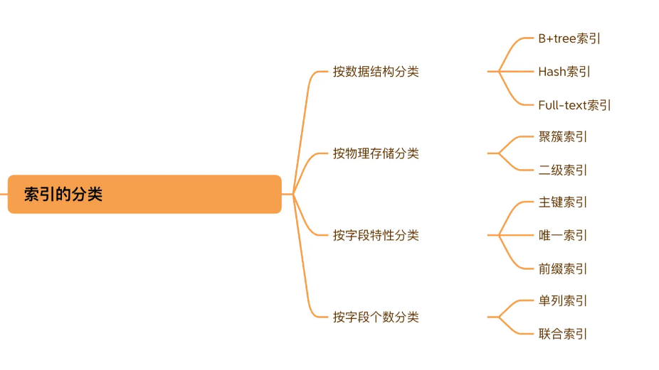

# 三、索引

## 1.概述与分类

MySQL官方对索引的定义为： **索引（Index）是帮助MySQL高效获取数据的数据结构 。**

优点是提高查询性能；缺点是占用更大存储空间，并且降低一些更新速度。



**Hash vs B+Tree**

Hash 在做等值查询的时候效率贼快，搜索复杂度为 O(1)。但是 Hash 表不适合做范围查询，它更适合做等值的查询。

## 2.创建与删除索引

**1. 创建表时创建索引**

```sql
CREATE TABLE table_name [col_name data_type] 
[UNIQUE | FULLTEXT | SPATIAL] [INDEX | KEY] [index_name] (col_name [length]) [ASC | DESC]
```

- `UNIQUE`、FULLTEXT和`SPATIAL`为可选参数，分别表示唯一索引、全文索引和空间索引；
- `INDEX`与`KEY`为同义词，两者的作用相同，用来指定创建索引；
- `index_name`指定索引的名称，为可选参数，如果不指定，那么MySQL默认col_name为索引名；
- `col_name`为需要创建索引的字段列，该列必须从数据表中定义的多个列中选择；
- `length`为可选参数，表示索引的长度，只有字符串类型的字段才能指定索引长度；
- `ASC`或`DESC`指定升序或者降序的索引值存储。

**2. 使用ALTER TABLE语句创建索引**

```sql
ALTER TABLE table_name 
ADD [UNIQUE | FULLTEXT | SPATIAL] [INDEX | KEY] [index_name] (col_name[length],...) [ASC | DESC]
```

**3. 使用CREATE INDEX创建索引**

```sql
CREATE [UNIQUE | FULLTEXT | SPATIAL] INDEX index_name 
ON table_name (col_name[length],...) [ASC | DESC]
```

**1.** **使用ALTER TABLE删除索引**

```sql
ALTER TABLE table_name DROP INDEX index_name;
```

**2. 使用DROP INDEX语句删除索引**

```sql
DROP INDEX index_name ON table_name;
```

## 3.索引创建原则

### 3.1 适合创建索引情况

**1. 字段的数值有唯一性的限制**

**2.** **频繁作为** **WHERE** **查询条件的字段**

**3.** **经常** **GROUP BY** **和** **ORDER BY** **的列**

**4. UPDATE、DELETE** **的** **WHERE** **条件列**(没理解)

对数据按照某个条件进行查询后再进行 UPDATE 或 DELETE 的操作，如果对 WHERE 字段创建了索引，就能大幅提升效率。原理是因为我们需要先根据 WHERE 条件列检索出来这条记录，然后再对它进行更新或删除。如果进行更新的时候，更新的字段是非索引字段，提升的效率会更明显，这是因为非索引字段更新不需要对索引进行维护。
**5.DISTINCT** **字段需要创建索引**

**6.** **多表** **JOIN** **连接操作时，链接的条件字段创建索引**

**7.** **使用列的类型小的创建索引**

**8.** **使用字符串前缀创建索引**

> **拓展：Alibaba《Java开发手册》**
>
> 【`强制`】在 varchar 字段上建立索引时，必须指定索引长度，没必要对全字段建立索引，根据实际文本区分度决定索引长度。
>
> 说明：一般对字符串类型数据，长度为 20 的索引，区分度会`高达 90% 以上`。

**9.** **区分度高(散列性高)的列适合作为索引**

**10.** **使用最频繁的列放到联合索引的左侧**

### 3.2 不适合创建索引情况

**1. 在where中使用不到的字段，不要设置索引**

**2. 数据量小的表最好不要使用索引**

**3. 有大量重复数据的列上不要建立索引**

**4. 避免对经常更新的表创建过多的索引**

**5. 不建议用无序的值作为索引**

例如身份证、UUID(在索引比较时需要转为ASCII，并且插入时可能造成页分裂)、MD5、HASH、无序长字符串等。

**6. 删除不再使用或者很少使用的索引**

**7. 不要定义冗余或重复的索引**
