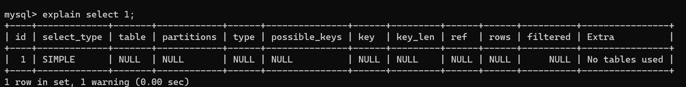
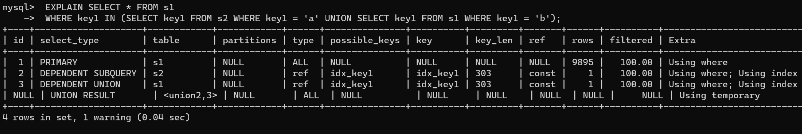

[第09章_性能分析工具的使用_路人甲_passerby的博客-CSDN博客](https://blog.csdn.net/w918589859/article/details/125023486)

# 1. 数据库服务器的优化步骤

当我们遇到数据库调优问题的时候，该如何思考呢？这里把思考的流程整理成下面这张图。

整个流程划分成了`观察（Show status）`和`行动（Action）`两个部分。字母 S 的部分代表观察（会使用相应的分析工具），字母 A 代表的部分是行动（对应分析可以采取的行动）。


我们可以通过观察了解数据库整体的运行状态，通过性能分析工具可以让我们了解执行慢的SQL都有哪些，查看具体的SQL执行计划，甚至是SQL执行中的每一步的成本代价，这样才能定位问题所在，找到了问题，再采取相应的行动。

**详细解释一下这张图:**

首先在S1部分，我们需要观察服务器的状态是否存在周期性的波动。如果`存在周期性波动`，有可能是周期性节点的原因，比如双十一、促销活动等。这样的话，我们可以通过A1这一步骤解决，也就是加缓存，或者更改缓存失效策略。

如果缓存策略没有解决，或者不是周期性波动的原因，我们就需要进一步`分析查询延迟和卡顿的原因`。接下来进入
S2这一步，我们需要`开启慢查询`。[慢查询](https://so.csdn.net/so/search?q=慢查询&spm=1001.2101.3001.7020)可以帮我们定位执行慢的SQL语句。我们可以通过设置`long_query_time`参数定义“慢”的阈值，如果SQL执行时间超过了`long_query_time`，则会认为是慢查询。当收集上来这些慢查询之后，我们就可以通过分析工具对慢查询日志进行分析。

在S3这一步骤中，我们就知道了执行慢的SQL，这样就可以针对性地用`EXPLAIN`查看对应SQL语句的执行计划，或者使用`show profile`查看SQL中每一个步骤的时间成本。这样我们就可以了解SQL查询慢是因为执行时间长，还是等待时间长。

如果是SQL等待时间长，我们进入A2步骤。在这一步骤中，我们可以`调优服务器的参数`，比如适当增加数据库缓冲池等。如果是SQL执行时间长，就进入A3步骤，这一步中我们需要考虑是索引设计的问题?还是查询关联的数据表过多?还是因为数据表的字段设计问题导致了这一现象。然后在这些维度上进行对应的调整。

如果A2和A3都不能解决问题，我们需要考虑数据库自身的SQL查询性能是否已经达到了瓶颈，如果确认没有达到性能瓶颈，就需要重新检查，重复以上的步骤。如果已经达到了`性能瓶颈`，进入A4阶段，需要考虑`增加服务器`，采用读写分离的架构，或者考虑对数据库进行`分库分表`，比如垂直分库、垂直分表和水平分表等。

以上就是数据库调优的流程思路。如果我们发现执行SQL时存在不规则延迟或卡顿的时候，就可以采用分析工具帮我们定位有问题的SQL，这三种分析工具你可以理解是SQL调优的三个步骤:`慢查询、` `EXPLAIN`和 `SHOWPROFILING`。

**小结：**


# 2. 查看系统性能参数

在MySQL中，可以使用`SHOW STATUS`语句查询一些MySQL数据库服务器的`性能参数`、`执行频率`。

SHOW STATUS语句语法如下：

```sql
SHOW [GLOBAL|SESSION] STATUS LIKE'参数';
12
```

一些常用的性能参数如下：

- Connections：连接MySQL服务器的次数。
- Uptime：MySQL服务器的上线时间。
- Slow_queries：慢查询的次数。
  - 默认十秒以上
- Innodb_rows_read：Select查询返回的行数

- Innodb_rows_inserted：执行INSERT操作插入的行数
- Innodb_rows_updated：执行UPDATE操作更新的行数
- Innodb_rows_deleted：执行DELETE操作删除的行数
- Com_select：查询操作的次数。

- Com_insert：插入操作的次数。对于批量插入的 INSERT 操作，只累加一次。
- Com_update：更新操作的次数。
- Com_delete：删除操作的次数。

例如：

若查询MySQL服务器的连接次数，则可以执行如下语句：

```sql
mysql> SHOW STATUS LIKE 'Connections';
+---------------+-------+
| Variable_name | Value |
+---------------+-------+
| Connections   | 8     |
+---------------+-------+
1 row in set (0.38 sec)
```

若查询服务器工作时间,则可以执行如下语句：

```sql
mysql> SHOW STATUS LIKE 'Uptime'; #秒
+---------------+-------+
| Variable_name | Value |
+---------------+-------+
| Uptime        | 838   |
+---------------+-------+
1 row in set (0.00 sec)
```

```sql
# 慢查询次数
mysql> show status like 'Slow_queries'; 
+---------------+-------+
| Variable_name | Value |
+---------------+-------+
| Slow_queries  | 0     |
+---------------+-------+
1 row in set (0.00 sec)

```

慢查询次数参数可以结合慢查询日志找出慢查询语句，然后针对慢查询语句进行`表结构优化`或者`查询语句优化`。再比如，如下的指令可以查看相关的指令情况:

```sql
mysql> show status like 'Innodb_rows_%';
+----------------------+-------+
| Variable_name        | Value |
+----------------------+-------+
| Innodb_rows_deleted  | 0     |
| Innodb_rows_inserted | 0     |
| Innodb_rows_read     | 0     |
| Innodb_rows_updated  | 0     |
+----------------------+-------+
4 rows in set (0.00 sec)
#Innodb_rows_read 查询数据的条数
```

# 3. 统计SQL的查询成本

一条SQL查询语句在执行前需要确定查询执行计划，如果存在多种执行计划的话，MySQL会计算每个执行计划所需要的成本，从中选择`成本最小`的一个作为最终执行的执行计划。

如果我们想要查看某条SQL语句的查询成本，可以在执行完这条SQL语句之后，通过查看当前会话中的`last_query_cost`变量值来得到当前查询的成本。它通常也是我们`评价一个查询的执行效率`的一个常用指标。这个查询成本对应的是`SQL语句所需要读取的页的数量`。

我们依然使用第8章的 student_info 表为例：如果我们想要查询 id=900001 的记录，然后看下查询成本，我们可以直接在聚簇索引上进行查找：

```sql
SELECT student_id, class_id, NAME, create_time FROM student_info WHERE id = 900001 ;
```

运行结果（1条记录，运行时间为 `0.042s`）

然后再看下查询优化器的成本，实际上我们只需要检索一个页即可：

```sql
mysql> SHOW STATUS LIKE 'last_query_cost';
+-----------------+----------+
| Variable_name   | Value    |
+-----------------+----------+
| Last_query_cost | 1.000000 |
+-----------------+----------+
1 row in set (0.01 sec)
# 当前查找的数据用到了一个数据页
```

如果我们想要查询 id 在 900001 到 9000100 之间的学生记录呢？

```sql
SELECT student_id, class_id, NAME, create_time FROM student_info
WHERE id BETWEEN 900001 AND 900100;
```

运行结果（100 条记录，运行时间为 `0.046s` ）

然后再看下查询优化器的成本，这时我们大概需要进行 20 个页的查询。

```sql
mysql> SHOW STATUS LIKE 'last_query_cost';
+-----------------+-----------+
| Variable_name   |   Value   |
+-----------------+-----------+
| Last_query_cost | 21.134453 |
+-----------------+-----------+
```

你能看到页的数量是刚才的 20 倍，但是查询的效率并没有明显的变化，实际上这两个 SQL 查询的时间基本上一样，就是因为采用了顺序读取的方式将页面一次性加载到缓冲池中，然后再进行查找。虽然`页数量（last_query_cost）增加了不少`，但是通过缓冲池的机制，`并没有增加多少查询时间`。

**使用场景：** 它对于比较开销是非常有用的，特别是我们有好几种查询方式可选的时候。

> SQL查询是一个动态的过程，从页加载的角度来看，我们可以得到以下两点结论:
>
> 1. `位置决定效率`。如果页就在数据库`缓冲池`中，那么效率是最高的，否则还需要从`磁盘`中进行
>    读取，当然针对单个页的读取来说，如果页存在于内存中，会比在磁盘中读取效率高很多。
> 2. `批量决定效率`。如果我们从磁盘中对单一页进行随机读，那么效率是很低的(差不多10ms)，而采用顺序读取的方式，批量对页进行读取，平均一页的读取效率就会提升很多，甚至要快于单个页面在内存中的随机读取。
>
> 所以说，遇到/O并不用担心，方法找对了，效率还是很高的。我们首先要考虑数据存放的位置，如果是经常使用的数据就要尽量放到`缓冲池`中，其次我们可以充分利用磁盘的吞吐能力，一次性批量读取数据，这样单个页的读取效率也就得到了提升。

# 4.定位执行慢的 SQL：慢查询日志

MySQL的慢查询日志，用来记录在MySQL中`响应时间超过阀值`的语句，具体指运行时间超过`long_query_time`值的SQL，则会被记录到慢查询日志中。long_query_time的默认值为`10`，意思是运行10秒以上(不含10秒)的语句，认为是超出了我们的最大忍耐时间值。

它的主要作用是，帮助我们发现那些执行时间特别长的SQL查询，并且有针对性地进行优化，从而提高系统的整体效率。当我们的数据库服务器发生阻塞、运行变慢的时候，检查一下慢查询日志，找到那些慢查询，对解决问题很有帮助。比如一条sq|执行超过5秒钟，我们就算慢SQL，希望能收集超过5秒的sql，结合explain进行全面分析。

默认情况下，MySQL数据库`没有开启慢查询日志`，需要我们手动来设置这个参数。**如果不是调优需要的话，一般不建议启动该参数**，因为开启慢查询日志会或多或少带来一定的性能影响

慢查询日志支持将日志记录写入文件。

## 4.1 开启慢查询日志参数

**1.开启slow_query_log**

```sql
mysql > show variables like '%slow_query_log%';
+---------------------+-----------------------------------+
| Variable_name       | Value                             |
+---------------------+-----------------------------------+
| slow_query_log      | OFF                               |
| slow_query_log_file | /var/lib/mysql/localhost-slow.log |
+---------------------+-----------------------------------+
2 rows in set (0.27 sec)


mysql > set global slow_query_log='ON'; #开启慢查询
Query OK, 0 rows affected (0.12 sec)
```

你能看到慢查询分析开启后，文件保存在 `/var/lib/mysql/atguigu02-slow.log` 文件中。

**2. 修改long_query_time阈值**

接下来我们来看下慢查询的时间阈值设置，使用如下命令：

```sql
mysql > show variables like '%long_query_time%';
```

```sql
# 测试发现：设置global的方式对当前session的long_query_time失效。对新连接的客户端有效。所以可以一并执行下述语句
mysql> set global long_query_time = 1;
mysql> show global variables like '%long-query_time%';

# 即更改global 也更改了session变量
mysql> set long_query_time=1;
mysql> show variables like '%long_query_time%';  
```

## 4.2 查看慢查询数目

查询当前系统中有多少条慢查询记录

```sql
SHOW GLOBAL STATUS LIKE '%Slow_queries%';
```

## 4.3 案例演示

## 4.4 测试及分析

## 4.5 慢查询日志分析工具：mysqldumpslow

在生产环境中，如果要手工分析日志，查找分析SQL，显然是个体力活，MySQL提供了日志分析工具`mysqldumpslow` 。

查看mysqldumpslow的帮助信息

```shell
mysqldumpslow --help
```

mysqldumpslow 命令的具体参数如下：

- -a: 不将数字抽象成N，字符串抽象成S
- -s: 是表示按照何种方式排序：
  - c: 访问次数
  - l: 锁定时间
  - r: 返回记录
  - **t: 查询时间**
  - al:平均锁定时间
- - ar:平均返回记录数
  - at:平均查询时间 （默认方式）
  - ac:平均查询次数
- **-t: 即为返回前面多少条的数据；**
- **-g: 后边搭配一个正则匹配模式，大小写不敏感的**

举例：我们想要按照查询时间排序，查看前五条 SQL 语句，这样写即可：

```sql
mysqldumpslow -s t -t 5 /var/lib/mysql/localhost-slow.log
```

**工作常用参考：**

```sql
#得到返回记录集最多的10个SQL
mysqldumpslow -s r -t 10 /var/lib/mysql/atguigu-slow.log

#得到访问次数最多的10个SQL
mysqldumpslow -s c -t 10 /var/lib/mysql/atguigu-slow.log

#得到按照时间排序的前10条里面含有左连接的查询语句
mysqldumpslow -s t -t 10 -g "left join" /var/lib/mysql/atguigu-slow.log

#另外建议在使用这些命令时结合 | 和more 使用 ，否则有可能出现爆屏情况
mysqldumpslow -s r -t 10 /var/lib/mysql/atguigu-slow.log | more
```

## 4.6 关闭慢查询日志

**除了调优需要开，正常还是不要开了**

MySQL服务器停止慢查询日志功能有两种方法：

**方式1：永久性方式**

```sql
[mysqld]
slow_query_log=OFF
```

或者，把slow_query_log一项注释掉 或 删除

```sql
mysqld]
#slow_query_log =OFF
```

重启MySQL服务，执行如下语句查询慢日志功能。

```sql
SHOW VARIABLES LIKE '%slow%'; #查询慢查询日志所在目录
SHOW VARIABLES LIKE '%long_query_time%'; #查询超时时长
```

**方式2：临时性方式**

使用SET语句来设置。 （1）停止MySQL慢查询日志功能，具体SQL语句如下。

```sql
SET GLOBAL slow_query_log=off;
```

重启MySQL服务，使用SHOW语句查询慢查询日志功能信息，具体SQL语句如下

```sql
SHOW VARIABLES LIKE '%slow%';
#以及
SHOW VARIABLES LIKE '%long_query_time%';
```

## 4.7 删除慢查询日志

```sql
mysql> show variables like '%slow_query_log%';
+---------------------+----------------------------+
| Variable_name       | Value                      |
+---------------------+----------------------------+
| slow_query_log      | ON                         |
| slow_query_log_file | /var/lib/mysql/my-slow.log |
+---------------------+----------------------------+
2 rows in set (0.07 se
```

从执行结果可以看出，慢查询日志的目录默认为MySQL的数据目录，在该目录下`手动删除慢查询日志文件`即可。使用命令`mysqladmin flush-logs` 来重新生成查询日志文件，具体命令如下，执行完毕会在数据目录下重新生成慢查询日志文件。

```sql
# 不使用这个命令，没办法自己创建
mysqladmin -uroot -p flush-logs slow 

## 这个命令可以重置其他日志 例如undo日志
```

> 提示
>
> 慢查询日志都是使用mysqladmin flush-logs命令来删除重建的。使用时-定要注意，一旦执行了这个命令，慢查询日志都只存在新的日志文件中，如果需要旧的查询日志，就必须事先备份。

# 5. 查看 SQL 执行成本：SHOW PROFILE

Show Profile是MySQL提供的可以用来分析当前会话中SQL都做了什么、执行的资源消耗情况的工具，可用于sql调优的测量。`默认情况下处于关闭状态`，并保存最近15次的运行结果。

我们可以在会话级别开启这个功能

```sql
mysql> show variables like 'profiling';
+---------------+-------+
| Variable_name | Value |
+---------------+-------+
| profiling     | OFF   |
+---------------+-------+
1 row in set (0.34 sec)
```

通过设置 `profiling='ON’` 来开启 show profile：

```sql
mysql> set profiling = 'ON';
Query OK, 0 rows affected, 1 warning (0.06 sec)

mysql> show variables like 'profiling';
+---------------+-------+
| Variable_name | Value |
+---------------+-------+
| profiling     | ON    |
+---------------+-------+
1 row in set (0.13 sec)
```

然后执行相关的查询语句。接着看下当前会话都有哪些 profiles，使用下面这条命令：

```sql
mysql> show profiles;
+----------+------------+-------------------------------------+
| Query_ID | Duration   | Query                               |
+----------+------------+-------------------------------------+
|        1 | 0.13515975 | show variables like 'profiling'     |
|        2 | 0.06386950 | select * from student_info limit 10 |
+----------+------------+-------------------------------------+
2 rows in set, 1 warning (0.01 sec)
```

你能看到当前会话一共有 2 个查询。如果我们想要查看最近一次查询的开销，可以使用：

```sql

mysql> show profile;
+--------------------------------+----------+
| Status                         | Duration |
+--------------------------------+----------+
| starting                       | 0.029330 |
| Executing hook on transaction  | 0.001174 |
| starting                       | 0.002804 |
| checking permissions           | 0.002918 |
| Opening tables                 | 0.009026 |
| init                           | 0.001605 |
| System lock                    | 0.000503 |
| optimizing                     | 0.000013 |
| statistics                     | 0.007651 |
| preparing                      | 0.000084 |
| executing                      | 0.005307 |
| end                            | 0.000017 |
| query end                      | 0.000178 |
| waiting for handler commit     | 0.000028 |
| closing tables                 | 0.001087 |
| freeing items                  | 0.000399 |
| cleaning up                    | 0.001748 |
+--------------------------------+----------+
17 rows in set, 1 warning (0.04 sec)
```

我们也可以查看指定的Query lD的开销，比如`show profile for query 2`查询结果是一样的。在SHOWPROFILE中我们可以查看不同部分的开销，比如cpu、block.io等:

```sql
mysql> show profile cpu,block io for query 2;
+------------------------------+--------+----------+------------+-------------+
| Status                       |Duration| CPU_user |Block_ops_in|Block_ops_out|
+------------------------------+--------+----------+------------+-------------+
| starting                     |0.029330| 0.017180 |       49712|            0|
| Executing hook on transaction|0.001174| 0.001079 |        3624|            0|
| starting                     |0.002804| 0.002169 |        4728|            0|
| checking permissions         |0.002918| 0.002437 |        8168|            0|
| Opening tables               |0.009026| 0.005841 |       14120|            0|
| init                         |0.001605| 0.000392 |          80|            0|
| System lock                  |0.000503| 0.000130 |          24|            0|
| optimizing                   |0.000013| 0.000010 |           0|            0|
| statistics                   |0.007651| 0.003072 |        4160|            0|
| preparing                    |0.000084| 0.000071 |           0|            0|
| executing                    |0.005307| 0.001609 |         568|            0|
| end                          |0.000017| 0.000011 |           0|            0|
| query end                    |0.000178| 0.000047 |           8|            0|
| waiting for handler commit   |0.000028| 0.000025 |           0|            0|
| closing tables               |0.001087| 0.000279 |          56|            0|
| freeing items                |0.000399| 0.000259 |           8|            0|
| cleaning up                  |0.001748| 0.000381 |          56|            0|
+------------------------------+--------+----------+------------+-------------+
17 rows in set, 1 warning (0.01 sec)
```

> 如果是executing比较长就可能是代码哪里没写好，使用explain 继续查询问题

**show profile的常用查询参数：**

① ALL：显示所有的开销信息。

② BLOCK IO：显示块IO开销。

③ CONTEXT SWITCHES：上下文切换开销。

④ CPU：显示CPU开销信息。

⑤ IPC：显示发送和接收开销信息。

⑥ MEMORY：显示内存开销信息。

⑦ PAGE FAULTS：显示页面错误开销信息。

⑧ SOURCE：显示和Source_function，Source_file，Source_line相关的开销信息。

⑨ SWAPS：显示交换次数开销信息。

**日常开发需注意的结论:**

1. `converting HEAP to MyISAM`: 查询结果太大，内存不够，数据往磁盘上搬了。
2. `creating tmp table:` 创建临时表。先拷贝数据到临时表，用完后再删除临时表。
3. `Copying to tmp table on disk`:把内存中临时表复制到磁盘上，警惕!
4. `locked` 。

如果在show profile诊断结果中出现了以上4条结果中的任何一条，则sql语句需要优化。

**注意:**

不过SHOW PROFILE命令将被弃用，我们可以从information_schema中的profiling数据表进行查看。

# 6. 分析查询语句：EXPLAIN

## 6.1 概述

**定位了查询慢的SQL之后，我们就可以使用EXPLAIN或DESCRIBE工具做针对性的分析查询语句。** DESCRIBE语句的使用方法与EXPLAIN语句是一样的，并且分析结果也是一样的。

MySQL中有专门负责优化SELECT语句的优化器模块，主要功能: 通过计算分析系统中收集到的统计信息，为客户端请求的Query提供它认为最优的`执行计划`（他认为最优的数据检索方式，但不见得是DBA认为是最优的，这部分最耗费时间)。

这个执行计划展示了接下来具体执行查询的方式，比如多表连接的顺序是什么，对于每个表采用什么访问方法来具体执行查询等等。MySQL为我们提供了`EXPLAIN`语句来帮助我们查看某个查询语句的具体执行计划，大家看懂`EXPLAIN`语句的各个输出项，可以有针对性的提升我们查询语句的性能。

**1.能做什么?**

- 表的读取顺序
- 数据读取操作的操作类型。
- 哪些索引可以使用
- **哪些索引被实际使用**
- 表之间的引用
- **每张表有多少行被优化器查询**

官网介绍

https://dev.mysql.com/doc/refman/5.7/en/explain-output.html
https://dev.mysql.com/doc/refman/8.0/en/explain-output.html

## 6.2 基本语法

EXPLAIN 或 DESCRIBE语句的语法形式如下：

```sql
EXPLAIN SELECT select_options #推荐
# 或者 两个是一样的
DESCRIBE SELECT select_options
```

如果我们想看看某个查询的执行计划的话，可以在具体的查询语句前边加一个 `EXPLAIN` 



输出的上述信息就是所谓的`执行计划`。在这个执行计划的辅助下，我们需要知道应该怎样改进自己的查询语句以使查询执行起来更高效。其实除了以`SELECT`开头的查询语句，其余的`DELETE`、`INSERT`、`REPLACE`以及`UPDATE`语句等都可以加上`EXPLAIN`,用来查看这些语句的执行计划，只是平时我们对SELECT语句更感兴趣。

**注意：执行EXPLAIN时并没有真正的执行该后面的语句，因此可以安全的查看执行计划。**

`EXPLAIN` 语句输出的各个列的作用如下

| 列名        | 描述                                                      |
| ----------- | --------------------------------------------------------- |
| id          | 在一个大的查询语句中每个SELECT关键字都对应一个 `唯一的id` |
| select_type | SELECT关键字对应的那个查询的类型                          |
| table | 表格 |
| partitions | 匹配的分区信息                 |
| **type**   | **针对单表的访问方法**（重要） |
| possible_keys | 可能用到的索引           |
| **key**       | **实际上使用的索引**     |
| **key_len**   | **实际使用到的索引长度** |
| ref      | 当使用索引列等值查询时，与索引列进行等值匹配的对象信息 |
| **rows** | **预估的需要读取的记录条数**                           |
| filtered | 某个表经过搜索条件过滤后剩余记录条数的百分比           |
| Extra    | 一些额外的信息                                         |

## 6.3 数据准备

## 6.4 EXPLAIN各列作用

**1. table**

**表名,查询的每一行记录都对应着一个单表**

**2. id**

**在一个大的查询语句中每个SELECT关键字都对应一个唯一的id,select查询的序列号,包含一组数字，表示查询中执行select子句或操作表的顺序**

正常来说一个select 一个id ，也有例外的可能，查询优化器做了优化

**查询优化器优化**

```sql
 ######查询优化器可能对涉及子查询的查询语句进行重写,转变为多表查询的操作########
 EXPLAIN SELECT * FROM s1 WHERE key1 IN (SELECT key2 FROM s2 WHERE common_field = 'a');
```

运行结果： id 只有一个，原因是查询优化器做了优化


**Union去重**

原本想的1个select 一个 id , 预计两个。

```sql
 #Union去重
# union 去重，union all 不去重
EXPLAIN SELECT * FROM s1 UNION SELECT * FROM s2;
```

有一个临时表


```sql
# union all 不去重  所以不需要放在临时表里面
mysql> EXPLAIN SELECT * FROM s1 UNION ALL SELECT * FROM s2;
```


**小结:**

- id如果相同，可以认为是一组，从上往下顺序执行

- id不同，如果是子查询，id的序号会递增，id值越大优先级越高，越先被执行
- 在所有组中，id值越大，优先级越高，越先执行
- 关注点：id号每个号码，表示一趟独立的查询, 一个sql的查询趟数越少越好

**3. select_type**

MySQL为每一个SELECT关键字代表的小查询都定义了一个称之为`select_type`的属性，意思是我们只要知道了某个小查询的`select_type属性`，就知道了这个`小查询在整个大查询中扮演了一个什么角色`，我们看一下`select_type`都能取哪些值，请看官方文档:

| 名称    | 描述                                          |
| ------- | --------------------------------------------- |
| SIMPLE  | Simple SELECT (not using UNION or subqueries) |
| PRIMARY | Outermost SELECT                              |
| UNION   | Second or later SELECT statement in a UNION   |
| UNION RESULT       | Result of a UNION                                  |
| SUBQUERY           | First SELECT in subquery                           |
| DEPENDENT SUBQUERY | First SELECT in subquery, dependent on outer query |
| DEPENDENT UNION | Second or later SELECT statement in a UNION, dependent on outer query |
| DERIVED         | Derived table                                                |
| MATERIALIZED    | Materialized subquery                                        |
| UNCACHEABLE SUBQUERY | A subquery for which the result cannot be cached and must be re-evaluated for each row of the outer query |
| UNCACHEABLE UNION | The second or later select in a UNION that belongs to an uncacheable subquery (see UNCACHEABLE SUBQUERY) |

- `SIMPLE`

```sql
 # 查询语句中不包含`UNION`或者子查询的查询都算作是`SIMPLE`类型
 EXPLAIN SELECT * FROM s1;
 
  #连接查询也算是`SIMPLE`类型
 EXPLAIN SELECT * FROM s1 INNER JOIN s2;
```

- `PRIMARY` 与 `UNION`与 `UNION RESULT`

测试sql:

```sql
 EXPLAIN SELECT * FROM s1 UNION SELECT * FROM s2;	
```


```sql
EXPLAIN SELECT * FROM s1 UNION ALL SELECT * FROM s2;
```


- `SUBQUERY`

如果包含子查询的查询语句不能够转为对应的`semi-join`的形式，并且该子查询是不相关子查询，并且查询优化器决定采用将该子查询物化的方案来执行该子查询时，该子查询的第个`SELECT` 关键字代表的那个查询的`select_type`就是 `SUBQUERY`，比如下边这个查询:


- `DEPENDENT SUBQUERY`

```sql
 #如果包含子查询的查询语句不能够转为对应的`semi-join`的形式，并且该子查询是相关子查询，则该子查询的第一个`SELECT`关键字代表的那个查询的`select_type`就是`DEPENDENT SUBQUERY`
 EXPLAIN SELECT * FROM s1 
 WHERE key1 IN (SELECT key1 FROM s2 WHERE s1.key2 = s2.key2) OR key3 = 'a';
 #注意的是，select_type为`DEPENDENT SUBQUERY`的查询可能会被执行多次。
```


- `DEPENDENT UNION`

```sql
 #在包含`UNION`或者`UNION ALL`的大查询中，如果各个小查询都依赖于外层查询的话，那除了最左边的那个小查询之外，其余的小查询的`select_type`的值就是`DEPENDENT UNION`。
 EXPLAIN SELECT * FROM s1 
 WHERE key1 IN (SELECT key1 FROM s2 WHERE key1 = 'a' UNION SELECT key1 FROM s1 WHERE key1 = 'b');
 
 # 这里优化器会重构成exist
```



- `DERIVED`派生

```sql
 #对于包含`派生表`的查询，该派生表对应的子查询的`select_type`就是`DERIVED`
 EXPLAIN SELECT * 
 FROM (SELECT key1, COUNT(*) AS c FROM s1 GROUP BY key1) AS derived_s1 WHERE c > 1;
```


- `MATERIALIZED`

```sql
#当查询优化器在执行包含子查询的语句时，选择将子查询物化之后与外层查询进行连接查询时，该子查询对应的`select_type`属性就是`MATERIALIZED`
EXPLAIN SELECT * FROM s1 WHERE key1 IN (SELECT key1 FROM s2); #子查询被转为了物化表 
```


- `UNCACHEABLE SUBQUERY`

- ``UNCACHEABLE UNION``

**4. partitions (可略)**

- 代表分区表中的命中情况，非分区表，该项为NULL。一般情况下我们的查询语句的执行计划的partitions列的值都是NULL。

**5. type ☆**

**针对单表的访问方法**

执行计划的一条记录就代表着MySQL对某个表的`执行查询时的访问方法`，又称"访问类型”，其中的`type`列就表明了这个访问方法是啥，是较为重要的一个指标。比如，看到`type`列的值是`ref`，表明MySQL即将使用`ref`访问方法来执行对`s1`表的查询。

完整的访问方法如下： `system` ， `const` ， `eq_ref` ， `ref` ， `fulltext` ， `ref_or_null` ，`index_merge` ， `unique_subquery` ， `index_subquery` ， `range` ， `index` ， `ALL` 。

我们详细解释一下：

- `system`

当表中`只有一条记录`并且该表使用的存储引擎的统计数据是精确的，比如MyISAM、Memory，那么对该表的访问方法就是`system`。

- `const`

当我们根据主键或者唯一二级索引列与常数进行等值匹配时，对单表的访问方法就是`const`

- `eq_ref`

对于每个来自于前面的表的行组合,从该表中读取一行。这可能是最好的联接类型,除了const类型。

在连接查询时，如果被驱动表是通过主键或者唯一二级索引列等值匹配的方式进行访问的（如果该主键或者唯一二级索引是联合索引的话，所有的索引列都必须进行等值比较），则对该被驱动表的访问方法就是`eq_ref`

```sql
mysql>  EXPLAIN SELECT * FROM s1 INNER JOIN s2 ON s1.id = s2.id;
+----+------------+------+--------+---------+---------+------------------+------+
| id | select_type| table| type   | key     | key_len | ref              | rows |
+----+------------+------+--------+---------+---------+------------------+------+
|  1 | SIMPLE     | s1   | ALL    | NULL    | NULL    | NULL             | 9895 |
|  1 | SIMPLE     | s2   | eq_ref | PRIMARY | 4       | atguigudb1.s1.id |    1 |
+----+------------+------+--------+---------+---------+------------------+------+
2 rows in set, 1 warning (0.00 sec)
```

从执行计划的结果中可以看出，MySQL打算将s2作为驱动表，s1作为被驱动表，重点关注s1的访问方法是 `eq_ref` ，表明在访问s1表的时候可以 `通过主键的等值匹配` 来进行访问。

- `ref`

非唯一性索引扫描，返回匹配某个单独值的所有行本质上也是一种索引访问，它返回所有匹配某个单独值的行，然而它可能会找到多个符合条件的行，所以他应该属于查找和扫描的混合体

当通过普通的二级索引列与常量进行等值匹配时来查询某个表，那么对该表的访问方法就可能是`ref`

```sql
EXPLAIN SELECT * FROM s1 WHERE key1 = 'a';
```

- `fulltext`

全文索引

- `ref_or_null`

当对普通二级索引进行等值匹配查询，该索引列的值也可以是`NULL`值时，那么对该表的访问方法，就可能是ref_or_null

```sql
EXPLAIN SELECT * FROM s1 WHERE key1 = 'a' OR key1 IS NULL;
```

- `index_merge`

**该联接类型表示使用了索引合并优化方法。**

单表访问方法时在某些场景下可以使用`Intersection`、`Union`、`Sort-Union`这三种索引合并的方式来执行查询

```sql
EXPLAIN SELECT * FROM s1 WHERE key1 = 'a' OR key3 = 'a';
```

```sql
mysql>  EXPLAIN SELECT * FROM s1 WHERE key1 = 'a' OR key3 = 'a';
+---+-------+------------+-------------------+--------+-------------------------------+
| id| table | type       | key               | key_len| Extra
+---+-------+------------+-------------------+--------+-------------------------------+
|  1| s1    | index_merge| idx_key1,idx_key3 | 303,303| Using union(idx_key1,idx_key3)|
+---+-------+------------+-------------------+--------+-------------------------------+
1 row in set, 1 warning (0.01 sec)
```

从执行计划的 `type` 列的值是 `index_merge` 就可以看出，MySQL 打算使用索引合并的方式来执行对 `s1` 表的查询。

- `unique_subquery`

`unique_subquery`是针对在一些包含`IN`子查询的查询语句中，如果查询优化器决定将`IN`子查询转换为`EXISTS`子查询，而且子查询可以使用到主键进行等值匹配的话，那么该子查询执行计划的`type`列的值就是`unique_subquery`

- `index_subquery`

  该联接类型类似于unique_subquery。可以替换IN子查询,但只适合下列形式的子查询中的非唯一索引

```sql
EXPLAIN SELECT * FROM s1 WHERE common_field IN (SELECT key3 FROM s2 where
s1.key1 = s2.key1) OR key3 = 'a';
```

- `range`

只检索给定范围的行,使用一个索引来选择行。
如果使用索引获取某些`范围区间`的记录，那么就可能使用到`range`访问方法

```sql
EXPLAIN SELECT * FROM s1 WHERE key1 IN ('a', 'b', 'c');

#同上
EXPLAIN SELECT * FROM s1 WHERE key1 > 'a' AND key1 < 'b';
```

- `index`

Full Index Scan,index与ALL区别为**index类型只遍历索引树** 。这通常比ALL快，因为索引文件通常比数据文件小。(也就是说虽然all和Index都是读全表，但index是从索引中读取的，而all是从硬盘中读的)

- `ALL`

将遍历全表以找到匹配的行

一般来说，这些访问方法中除了`All`这个访问方法外，其余的访问方法都能用到索引，除了`index_merge`访问方法外，其余的访问方法都最多只能用到一个索引。

**小结:**

**结果值从最好到最坏依次是：**

system > const > eq_ref > ref > fulltext > ref_or_null > index_merge >unique_subquery > index_subquery > range >index > ALL

**SQL 性能优化的目标：至少要达到 range 级别，要求是 ref 级别，最好是 consts级别。（阿里巴巴开发手册要求）**

**6. possible_keys和key**

possible_keys表示可能用到的索引，key表示实际用到的索引。

**7. key_len ☆**

实际使用到的索引长度(即：字节数)，**在联合索引里面，命中一次key_len加一次长度。**

**key_len的长度计算公式：**

```sql
varchar(10)变长字段且允许NULL = 10 * ( character set：utf8=3,gbk=2,latin1=1)+1(NULL)+2(变长字段)

varchar(10)变长字段且不允许NULL = 10 * ( character set：utf8=3,gbk=2,latin1=1)+2(变长字段)

char(10)固定字段且允许NULL = 10 * ( character set：utf8=3,gbk=2,latin1=1)+1(NULL)

char(10)固定字段且不允许NULL = 10 * ( character set：utf8=3,gbk=2,latin1=1)
```

**8. ref**

当使用索引列等值查询时，与索引列进行等值匹配的对象信息。比如只是一个常数、某个列或函数。常量

```sql
mysql> EXPLAIN SELECT * FROM s1 WHERE key1 = 'a';   # 与常数匹配
+----+-------------+------+------+---------------+----------+---------+-------+
| id | select_type | table| type | possible_keys | key      | key_len | ref   |
+----+-------------+------+------+---------------+----------+---------+-------+
|  1 | SIMPLE      | s1   | ref  | idx_key1      | idx_key1 | 303     | const |  
+----+-------------+------+------+---------------+----------+---------+-------+
```

```sql
mysql> EXPLAIN SELECT * FROM s1 INNER JOIN s2 ON s1.id = s2.id;   #与某个列匹配
+---+------+--------+---------------+--------+------------------+-----
| id| table| type   | possible_keys | key    | ref              | rows
+---+------+--------+---------------+--------+------------------+-----
|  1| s1   | ALL    | PRIMARY       | NULL   | NULL             | 9895
|  1| s2   | eq_ref | PRIMARY       | PRIMARY| atguigudb1.s1.id |    1
+---+------+--------+---------------+--------+------------------+-----
```

```sql
mysql> EXPLAIN SELECT * FROM s1 INNER JOIN s2 ON s2.key1 = UPPER(s1.key1);  #与func匹配
+----+------+------+---------------+----------+---------+------+------+----------------------+
| id | table| type | possible_keys | key      | key_len | ref  | rows |Extra                 |
+----+------+------+---------------+----------+---------+------+------+----------------------+
|  1 | s1   | ALL  | NULL          | NULL     | NULL    | NULL | 9895 |NULL                  |
|  1 | s2   | ref  | idx_key1      | idx_key1 | 303     | func |    1 |Using index condition |
+----+------+------+---------------+----------+---------+------+------+----------------------+
```

**9. rows ☆**

**预估的需要读取的记录条数**，通常和filtered一起使用。

**10. filtered**

filtered 为实际用到的行占总读到的行(rows 列的值)的百分比。

**11. Extra ☆**

Extra列是用来说明一些额外信息的

- Using index

  表示覆盖索引，没有回表。如果还有using where 则不是覆盖索引，进行了回表。

- Using index condition

  表示进行了索引条件下推。即key1 > 'z'查询到一条数据后先进行 LIKE '%a'过滤再回表。

```sql
mysql> EXPLAIN SELECT * FROM s1 WHERE key1 > 'z' AND key1 LIKE '%a';
```

- Using join buffer

  表示进行了表连接

- Using intersect(...) 、 Using union(...) 和 Using sort_union(...)
  - 如果执行计划的`Extra`列出现了`Using intersect(...)`提示，说明准备使用`Intersect`索引
  - 合并的方式执行查询，括号中的`...`表示需要进行索引合并的索引名称；
  - 如果出现了`Using union(...)`提示，说明准备使用`Union`索引合并的方式执行查询；
  - 出现了`Using sort_union(...)`提示，说明准备使用`Sort-Union`索引合并的方式执行查询。

- Using filesort

  说明mysql会对数据使用一个外部的索引排序，而不是按照表内的索引顺序进行读取。MySQL中无法利用索引完成的排序操作称为文件排序”

- Using temporary

  表示使用了临时表，`DISTINCT`、`GROUP BY`、`UNION`等子句的查询过程中，如果不能有效利用索引来完成查询，MySQL很通过建立内部的临时表来执行查询。

**12. 小结**

- EXPLAIN不考虑各种Cache
- EXPLAIN不能显示MySQL在执行查询时所作的优化工作
- EXPLAIN不会告诉你关于触发器、存储过程的信息或用户自定义函数对查询的影响情况
- 部分统计信息是估算的，并非精确值

# 7.EXPLAIN进一步使用

# 8. 分析优化器执行计划：trace
