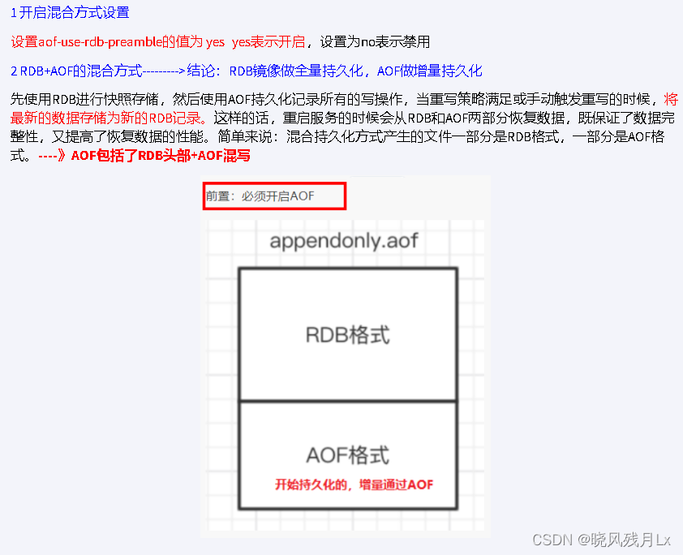
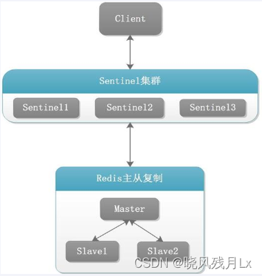
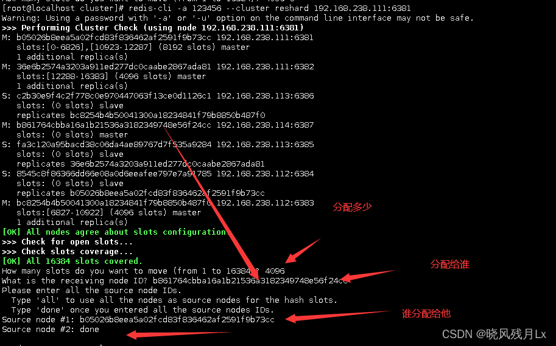

# 一、介绍与安装

### 1.1 基本了解

  **Remote Dictionary Server** ( **远程字典服务** )是完全开源的，使用ANSIC语言编写遵守[BSD](https://so.csdn.net/so/search?q=BSD&spm=1001.2101.3001.7020)协议，是一个高性能的Key-Value数据库提供了丰富的数据结构，例如String、Hash、List、Set、SortedSet等等。数据是存在内存中的，同时Redis支持事务、持久化、LUA脚本、发布/订阅、缓存淘汰、流技术等多种功能特性提供了主从模式、Redis Sentinel和Redis Cluster集群架构方案。

### 1.2 功能

* 分布式缓存，挡在mysql数据库之前的一道屏障
* 内存存储和持久化（RDB+AOF），redis支持异步将内存中的数据写到硬盘上，同时不影响继续服务
* 高可用架构搭配
  * 单机
  * 主从
  * 哨兵
  * 集群
* 缓存穿透、击穿、雪崩
* 分布式锁
* 队列
  * Reids提供list和set操作，这使得Redis能作为一个很好的消息队列平台来使用。
  * 我们常通过Reids的队列功能做购买限制。比如到节假日或者推广期间，进行一些活动，对用户购买行为进行限制，限制今天只能购买几次商品或者一段时间内只能购买一次。也比较适合适用。
* 排行榜+点赞
  * 在互联网应用中，有各种各样的排行榜，如电商网站的月度销量排行榜、社交APP的礼物排行榜、小程序的投票排行榜等等。Redis提供的zset数据类型能够快速实现这些复杂的排行榜。比如小说网站对小说进行排名，根据排名，将排名靠前的小说推荐给用户

### 1.3 安装

尽量安装在linux中，可以复用linux的多路复用，性能更好。当然windows中也可以安装但不建议。

1. linux中安装gcc环境：`yum -y install gcc- c++`
2. 下载redis并放入linux解压
3. 进入解压目录执行：`make && make install`进行安装。
4. 安装成功后，默认安装在/usr/local/bin/中

### 1.4 启动与关闭

启动服务：`redis-server [配置文件路径]`

启动客户端：`redis-cli -a 密码 -p 6379`（默认端口-p为6379）

关闭客户端：`quit`

关闭redis服务：`redis-cli -a 密码 -p 6379 shutdown`（默认端口-p为6379）；或者在客户端中：`shutdown`

# 二、数据类型

**redis是k-v键值对进行存储，这里的数据类型是value的数据类型，key的类型都是字符串**

1. String 字符串
2. List 列表
3. Hash 哈希表
4. Set 无序集合
5. Zset 有序集合(Sort set)
6. GEO 地理空间（经纬度）
7. HyperLogLog 基数统计（比如统计有多少不重复用户上线）
8. bitmap 位图
9. bitfield 位域
10. Stream 流

## key操作命令

| 命令                                                   | 描述                                                  |
| :----------------------------------------------------- | :---------------------------------------------------- |
| [DEL](https://redis.com.cn/commands/del.html)             | 用于阻塞删除 key                                      |
| unlink                                                 | 非阻塞删除key                                         |
| [DUMP](https://redis.com.cn/commands/dump.html)           | 序列化给定 key ，并返回被序列化的值                   |
| [EXISTS](https://redis.com.cn/commands/exists.html)       | 检查给定 key 是否存在                                 |
| [EXPIRE](https://redis.com.cn/commands/expire.html)       | 为给定 key 设置过期时间                               |
| [EXPIREAT](https://redis.com.cn/commands/expireat.html)   | 用于为 key 设置过期时间，接受的时间参数是 UNIX 时间戳 |
| [PEXPIRE](https://redis.com.cn/commands/pexpire.html)     | 设置 key 的过期时间，以毫秒计                         |
| [PEXPIREAT](https://redis.com.cn/commands/pexpireat.html) | 设置 key 过期时间的时间戳(unix timestamp)，以毫秒计   |
| [KEYS](https://redis.com.cn/commands/keys.html)           | 查找所有符合给定模式的 key                            |
| [MOVE](https://redis.com.cn/commands/move.html)           | 将当前数据库的 key 移动到给定的数据库中               |
| [PERSIST](https://redis.com.cn/commands/persist.html)     | 移除 key 的过期时间，key 将持久保持                   |
| [PTTL](https://redis.com.cn/commands/pttl.html)           | 以毫秒为单位返回 key 的剩余的过期时间                 |
| [TTL](https://redis.com.cn/commands/ttl.html)             | 以秒为单位，返回给定 key 的剩余生存时间(              |
| [RANDOMKEY](https://redis.com.cn/commands/randomkey.html) | 从当前数据库中随机返回一个 key                        |
| [RENAME](https://redis.com.cn/commands/rename.html)       | 修改 key 的名称                                       |
| [RENAMENX](https://redis.com.cn/commands/renamenx.html)   | 仅当 newkey 不存在时，将 key 改名为 newkey            |
| [TYPE](https://redis.com.cn/commands/type.html)           | 返回 key 所储存的值的类型                             |

```js
keys *  		//当前库的所有key
exists key      //判断某个key是否存在
type key        //查看你的key是什么类型
del key         //删除指定的key数据
unlink key      //非阻塞删除，仅仅将keys从keyspace元数据中删除，没真正的删除会在后续异步中操作
ttl key         // 查看还有多少秒过期 -1表示永不过期 -2 表示已过期
expire key 秒    // 给key设置过期时间
move key dbindex [0-15]   // 将当前数据库的key移动到指定的数据库中  redis默认是有16个数据库的
select dbindex [0-15]   // 切换数据库[0-15]，默认为0
dbsize   			// 查看当前数据库key的数量
flushdb         		// 清空当前库
flushall 			// 清空16个数据库 慎用

```

**命令不区分大小写，而key的值是区分大小写的**

**help @+数据类型 会出现命令提示 比如 help @string**

## String

* string类型是二进制安全的，意思是redis的string可以包含任何数据，比如jpg图片或者序列化的对象 。
* string类型是Redis最基本的数据类型，一个redis中字符串value最多可以是512M

下表列出了常用的 redis 字符串命令：

| 命令                                             | 描述                                                        |
| :----------------------------------------------- | :---------------------------------------------------------- |
| [SET](https://redis.com.cn/commands/set.html)       | 设置指定 key 的值                                           |
| [GET](https://redis.com.cn/commands/get.html)       | 获取指定 key 的值                                           |
| [GETSET](https://redis.com.cn/commands/getset.html) | 将给定 key 的值设为 value ，并返回 key 的旧值 ( old value ) |
| GETRANGE key start end                           | 返回 key 中字符串值的子字符                                 |
| SETRANGE key offset value                        | 从偏移量 offset 开始用 value 覆写给定 key 所储存的字符串值  |
| [MGET](https://redis.com.cn/commands/mget.html)     | 获取所有(一个或多个)给定 key 的值                           |
| [MSET](https://redis.com.cn/commands/mset.html)     | 同时设置一个或多个 key-value 对                             |
| GETBIT key offset                                | 对 key 所储存的字符串值，获取指定偏移量上的位 ( bit )       |
| SETBIT key offset value                          | 对 key 所储存的字符串值，设置或清除指定偏移量上的位(bit)    |
| [STRLEN](https://redis.com.cn/commands/strlen.html) | 返回 key 所储存的字符串值的长度                             |
| [INCR](https://redis.com.cn/commands/incr.html)     | 将 key 中储存的数字值增一                                   |
| INCRBY key increment                             | 将 key 所储存的值加上给定的增量值 ( increment )             |
| INCRBYFLOAT key increment                        | 将 key 所储存的值加上给定的浮点增量值 ( increment )         |
| [DECR](https://redis.com.cn/commands/decr.html)     | 将 key 中储存的数字值减一                                   |
| [DECRBY](https://redis.com.cn/commands/decrby.html) | 将 key 所储存的值减去给定的减量值 ( decrement )             |
| APPEND key value                                 | 将 value 追加到 key 原来的值的末尾                          |


**常用的：**

```java
set key value ex 20   // 设置值 20秒过期
get key   // 获得对应的value值
```

同时设置/获取多个键值

```java
MSET [key1] [value1] [key2] [value2] [key3] [value3]  // 同时设置一个或多个键值对
MGET [key1] [key2] [key3]  // 同时获取多个key的值
MSETNX [key1] [value1] [key2] [value2]  // 同时设置一个或多个 key-value 对  必须保证key都不存在才能成功
```

获取指定区间

```java
GETRANGE [key] 0 -1  // 获取这个key的value值
GETRANGE [key] 0 2   // 获取索引0到索引2之间的value值
SETRANGE [key] 1 xxx  // 设置索引1开始的字符串
```

获取字符串长度和内容相加

```java
STRLEN [key]        // 获取key对应的值的长度
APPEND [key] [vale]   // 添加字符串内容
```

数值增减

```java
INCR [key]    // 递增数字 +1
INCRBY [key] [increment]   // 增加指定的整数  +increment 
DECR [key]   // 递减数字 -1
DECRBY [key] [increment]   // 减少指定的整数  -increment 
```

## List

一个双向链表主要功能有push/pop。

| 命令                                                                             | 描述                                                     |
| :------------------------------------------------------------------------------- | :------------------------------------------------------- |
| [LPUSH](https://redis.com.cn/commands/lpush.html)                                   | 将一个或多个值插入到列表头部                             |
| [LPOP](https://redis.com.cn/commands/lpop.html)                                     | 移出并获取列表的第一个元素                               |
| [RPUSH](https://redis.com.cn/commands/rpush.html)                                   | 在列表中添加一个或多个值                                 |
| [RPOP](https://redis.com.cn/commands/rpop.html)                                     | 移除并获取列表最后一个元素                               |
| [LLEN](https://redis.com.cn/commands/llen.html)                                     | 获取列表长度                                             |
| [LSET](https://redis.com.cn/commands/lset.html)                                     | 通过索引设置列表元素的值                                 |
| [LINDEX](https://redis.com.cn/commands/lindex.html)                                 | 通过索引获取列表中的元素                                 |
| [LRANGE](https://redis.com.cn/commands/lrange.html)                                 | 获取列表指定范围内的元素                                 |
| [RPOPLPUSH](https://redis.com.cn/commands/rpoplpush.html)                           | 移除列表的最后一个元素，并将该元素添加到另一个列表并返回 |
| [LREM](https://redis.com.cn/commands/lrem.html)                                     | 移除列表元素                                             |
| [LTRIM](https://redis.com.cn/commands/ltrim.html)                                   | 对一个列表进行修剪(trim)                                 |
| [LINSERT key before/after 已有值 value](https://redis.com.cn/commands/linsert.html) | 在列表第一个已有值前或者后插入元素                       |
| [LPUSHX](https://redis.com.cn/commands/lpushx.html)                                 | 将一个值插入到已存在的列表头部                           |
| [RPUSHX](https://redis.com.cn/commands/rpushx.html)                                 | 为已存在的列表添加值                                     |
| [BLPOP](https://redis.com.cn/commands/blpop.html)                                   | 移出并获取列表的第一个元素                               |
| [BRPOP](https://redis.com.cn/commands/brpop.html)                                   | 移出并获取列表的最后一个元素                             |
| [BRPOPLPUSH](https://redis.com.cn/commands/brpoplpush.html)                         | 从列表中弹出一个值，并将该值插入到另外一个列表中并返回它 |

## Hash

| 命令                                               | 说明                                          |
| :------------------------------------------------- | :-------------------------------------------- |
| [HSET](https://redis.com.cn/commands/hset.html)       | 用于设置存储在 key 中的哈希表字段的值         |
| [HGET](https://redis.com.cn/commands/hget.html)       | 获取存储在哈希表中指定字段的值                |
| [HDEL](https://redis.com.cn/commands/hdel.html)       | 用于删除哈希表中一个或多个字段                |
| [HGETALL](https://redis.com.cn/commands/hgetall.html) | 获取在哈希表中指定 key 的所有字段和值         |
| [HLEN](https://redis.com.cn/commands/hlen.html)       | 获取存储在 key 中的哈希表的字段数量           |
| [HEXISTS](https://redis.com.cn/commands/hexists.html) | 用于判断哈希表中字段是否存在                  |
| [HKEYS](https://redis.com.cn/commands/hkeys.html)     | 获取存储在 key 中的哈希表的所有字段           |
| [HVALS](https://redis.com.cn/commands/hvals.html)     | 用于获取哈希表中的所有值                      |
| [HINCRBY](https://redis.com.cn/commands/hincrby.html) | 为存储在 key 中的哈希表指定字段做整数增量运算 |

## Set

| 命令                                                       | 描述                                                |
| :--------------------------------------------------------- | :-------------------------------------------------- |
| [SADD](https://redis.com.cn/commands/sadd.html)               | 向集合添加一个或多个成员                            |
| [SMEMBERS](https://redis.com.cn/commands/smembers.html)       | 返回集合中的所有成员                                |
| [SISMEMBER](https://redis.com.cn/commands/sismember.html)     | 判断 member 元素是否是集合 key 的成员               |
| [SREM](https://redis.com.cn/commands/srem.html)               | 移除集合中一个或多个成员                            |
| [SCARD](https://redis.com.cn/commands/scard.html)             | 获取集合的成员数                                    |
| [SRANDMEMBER](https://redis.com.cn/commands/srandmember.html) | 返回集合中一个或多个随机数                          |
| [SPOP](https://redis.com.cn/commands/spop.html)               | 移除并返回集合中的一个随机元素                      |
| [SMOVE](https://redis.com.cn/commands/smove.html)             | 将 member 元素从 source 集合移动到 destination 集合 |
| [SSCAN](https://redis.com.cn/commands/sscan.html)             | 迭代集合中的元素                                    |
| [SINTER](https://redis.com.cn/commands/sinter.html)           | 返回给定所有集合的交集                              |
| [SDIFF](https://redis.com.cn/commands/sdiff.html)             | 返回给定所有集合的差集                              |
| [SUNION](https://redis.com.cn/commands/sunion.html)           | 返回所有给定集合的并集                              |
| [SINTERSTORE](https://redis.com.cn/commands/sinterstore.html) | 返回给定所有集合的交集并存储在 destination 中       |
| [SDIFFSTORE](https://redis.com.cn/commands/sdiffstore.html)   | 返回给定所有集合的差集并存储在 destination 中       |
| [SUNIONSTORE](https://redis.com.cn/commands/sunionstore.html) | 所有给定集合的并集存储在 destination 集合中         |

## Zset

| 命令                                                                 | 描述                                                                              |
| :------------------------------------------------------------------- | :-------------------------------------------------------------------------------- |
| [ZADD](https://redis.com.cn/commands/zadd.html)                         | 添加一个或多个成员，或者更新已存在成员的分数                                      |
| [ZRANGE](https://redis.com.cn/commands/zrange.html)                     | 通过索引区间分数从小到大的成员                                                    |
| [ZREVRANGE](https://redis.com.cn/commands/zrevrange.html)               | 通过索引区间分数从高到底的成员                                                    |
| [ZRANGEBYSCORE](https://redis.com.cn/commands/zrangebyscore.html)       | 通过分数返回指定区间内的成员                                                      |
| [ZSCORE](https://redis.com.cn/commands/zscore.html)                     | 返回成员的分数值                                                                  |
| [ZREM](https://redis.com.cn/commands/zrem.html)                         | 移除一个或多个成员                                                                |
| [ZCARD](https://redis.com.cn/commands/zcard.html)                       | 获取集合成员数                                                                    |
| [ZCOUNT](https://redis.com.cn/commands/zcount.html)                     | 计算指定区间分数的成员数                                                          |
| [ZINCRBY](https://redis.com.cn/commands/zincrby.html)                   | 对指定成员的分数加上增量 increment                                                |
| [ZRANK](https://redis.com.cn/commands/zrank.html)                       | 返回指定成员的索引                                                                |
| [ZREVRANK](https://redis.com.cn/commands/zrevrank.html)                 | 分数从高到底排序后，返回成员的索引                                                |
| zmpop numkeys key... min\|max [COUNT count]                          | numkeys指定key的数量。min\|max代表弹出是最大或最小分数。count指定要弹出的成员数量 |
| [ZINTERSTORE](https://redis.com.cn/commands/zinterstore.html)           | 计算给定的一个或多个有序集的交集并将结果集存储在新的有序集合 key 中               |
| [ZLEXCOUNT](https://redis.com.cn/commands/zlexcount.html)               | 在有序集合中计算指定字典区间内成员数量                                            |
| [ZRANGEBYLEX](https://redis.com.cn/commands/zrangebylex.html)           | 通过字典区间返回有序集合的成员                                                    |
| [ZREMRANGEBYLEX](https://redis.com.cn/commands/zremrangebylex.html)     | 移除有序集合中给定的字典区间的所有成员                                            |
| [ZREMRANGEBYRANK](https://redis.com.cn/commands/zremrangebyrank.html)   | 移除有序集合中给定的排名区间的所有成员                                            |
| [ZREMRANGEBYSCORE](https://redis.com.cn/commands/zremrangebyscore.html) | 移除有序集合中给定的分数区间的所有成员                                            |
| [ZREVRANGEBYSCORE](https://redis.com.cn/commands/zrevrangebyscore.html) | 返回有序集中指定分数区间内的成员，分数从高到低排序                                |
| [ZUNIONSTORE](https://redis.com.cn/commands/zunionstore.html)           | 计算一个或多个有序集的并集，并存储在新的 key 中                                   |
| [ZSCAN](https://redis.com.cn/commands/zscan.html)                       | 迭代有序集合中的元素（包括元素成员和元素分值）                                    |

## Bitmap

**我们可以简单的认为就是个数组，只是里面的内容只能为0或1而已(二进制位数组)。**

| 命令     | 描述                                                                                            |
| -------- | ----------------------------------------------------------------------------------------------- |
| SETBIT   | 为位数组指定偏移量上的二进制位设置值，偏移量从0开始计数，二进制位的值只能为0或1。返回原位置值。 |
| GETBIT   | 获取指定偏移量上二进制位的值。                                                                  |
| BITCOUNT | 统计位数组中值为1的二进制位数量。                                                               |
| BITOP    | 对多个位数组进行按位与、或、异或运算。                                                          |

属于stirng类型，可以类似理解为shring子类。

## HyperLogLog

| 命令                                               | 描述                                      |
| :------------------------------------------------- | :---------------------------------------- |
| `PFGMERGE`                                       | 将多个 HyperLogLog 合并为一个 HyperLogLog |
| [PFADD](https://redis.com.cn/commands/pfadd.html)     | 添加指定元素到 HyperLogLog 中。           |
| [PFCOUNT](https://redis.com.cn/commands/pfcount.html) | 返回给定 HyperLogLog 的基数估算值。       |

属于stirng类型，可以类似理解为shring子类。

## GEO

本质为zset，geoadd 键名 经纬度 地点

| 命令                                                                   | 描述                                                      |
| :--------------------------------------------------------------------- | :-------------------------------------------------------- |
| [GEOADD](https://redis.com.cn/commands/geoadd.html)                       | 将指定的地理空间位置（纬度、经度、名称）添加到指定的key中 |
| [GEOPOS](https://redis.com.cn/commands/geopos.html)                       | 从key里返回所有给定位置元素的位置（经度和纬度）           |
| [GEOHASH](https://redis.com.cn/commands/geohash.html)                     | 返回一个或多个位置元素的 Geohash 表示                     |
| [GEODIST](https://redis.com.cn/commands/geodist.html)                     | 返回两个给定位置之间的距离                                |
| [GEORADIUS](https://redis.com.cn/commands/georadius.html)                 | 以给定的经纬度为中心， 找出某一半径内的元素               |
| [GEORADIUSBYMEMBER](https://redis.com.cn/commands/georadiusbymember.html) | 找出位于指定范围内的元素，中心点是由给定的位置元素决定    |

## Stream

## Bitfield

# 三、持久化

## 1.RDB

RDB（Redis Data Base）：RDB 持久性以指定的时间间隔执行数据集的时间点快照。


**哪些情况会触发RDB快照：**

- 配置文件中默认的快照配置
- 手动 save/bgsave 命令（save会阻塞redis服务器）
- 执行flush / flushdb 命令也会产生 dump.rdb 文件，但里面是空的，无意义
- 执行 shutdown 且没有设置开启 AOF 持久化
- 主从复制时，主节点自动触发


**优势**

- 适合大规模的数据恢复
- 按照业务定时备份
- 对数据完整性和一致性要求不高
- RDB 文件在内存中的加载速度比AOF快得多

**劣势**

- 在一定间隔时间做一次备份，如果redis意外down机，就会丢掉最近一次快照到down机时的数据
- 内存数量的全量同步，如果数据量过大会导致IO严重影响服务器性能
- RDB依赖于主进程的 fork ，在更大的数据集中，这可能会导致服务器请求的瞬间延迟
  - fork 的时候内存中的数据被克隆了一份，大致2倍的膨胀性，需要考虑

## 2.AOF

以日志的形式来记录每个写操作，将Redis执行过的所有写指令记录下来


三种写回策略

- always 同步写回，每个写命令执行完立刻同步地将日志写回磁盘
- everysec 每秒写回，每个写命令执行完，只是先把日志写到AOF缓冲区，每隔1s把缓存区地数据写入磁盘
- 操作系统控制协会，只是将日志先写到AOF文件的内存缓冲区，由操作系统决定何时将缓冲区内容写回磁盘

**优势**

- 更好的保护数据不丢失、性能高、可做紧急恢复

**劣势**

- 相同数据集的数据而言aof文件要远大于rdb文件，恢复速度慢于rdb
- aof运行效率要慢于rdb，每秒同步策略效率较好，不同步效率和rdb相同

## 3.混合模式




# 四、复制

###  介绍

- [主从复制](https://so.csdn.net/so/search?q=主从复制&spm=1001.2101.3001.7020)
  - master以写为主，slave以读为主
  - 当master数据变化时，自动将新的数据异步同步到其他slave数据库
- 读写分离
- down机恢复
- [数据备份](https://so.csdn.net/so/search?q=数据备份&spm=1001.2101.3001.7020)
- 水平扩容支撑高并发

### 操作命令

```
info replication   查看复制节点的主从关系和配置信息
    
replicaof/slaveof 主库IP 主库端口   是当前数据库从属与主库，一般写入进redis.conf配置文件内。

replicaof/slaveof no one      使当前数据库停止与其他数据库的同步，升级为主数据库
```


# 五、哨兵

### 介绍

- [哨兵](https://so.csdn.net/so/search?q=哨兵&spm=1001.2101.3001.7020)巡查监控后台master主机是否故障，如果故障了根据投票数自动将某一个从库转换为新主库，继续对外服务，俗称**无人值守运维**
- **作用**
  - 监控redis运行状态，包括master和slave
  - 当master down机，能自动将slave切换成新master
- 哨兵的四个功能

  - 主从监控
    - 监控主从redis库运行是否正常
  - 消息通知
    - 哨兵可以将故障转移的结果发送到客户端
  - 故障转移
    - 如果master异常，则会进行主从切换，将其中一个slave作为新master
  - 配置中心
    - 客户端通过连接哨兵来获得当前Redis服务的主节点地址



### 示例配置文件

**redis6379.conf**

```
port 6379
daemonize yes
bind 0.0.0.0 #或者注释掉
protected-mode no
dir /myredis
pidfile "/var/run/redis_6379.pid"
logfile "/myredis/6379.log"
requirepass "123456"
dbfilename "dump6379.rdb"
appendonly yes
appendfilename "appendonly.aof"
# replicaof 192.168.2.80 6380
masterauth "123456"
```

sentinel26379.conf

```
port 6379
daemonize yes
bind 0.0.0.0 #或者注释掉
protected-mode no
dir /myredis
pidfile "/var/run/redis_6379.pid"
logfile "/myredis/6379.log"
sentinel monitor mymaster 192.168.2.79 6379 2
```

### 启动

```
6379.conf
	redis-server /myredis/redis6379.conf 
	redis-cli -a 123456

6380.conf
	redis-server /myredis/redis6380.conf 
	redis-cli -a 123456 -p 6380

6381.conf
	redis-server /myredis/redis6381.conf 
    redis-cli -a 123456 -p 6381
```

```
redis-sentinel sentinel26379.conf --sentinel
redis-sentinel sentinel26380.conf --sentinel
redis-sentinel sentinel26381.conf --sentinel
```

- 哨兵节点的数量应为多个，哨兵本身应该集群，保证高可用
- 哨兵节点的数量应该是奇数个
- 各个哨兵节点的配置应该一致
- 如果哨兵节点部署在Docker等容器里，要注意端口的正确映射
- 哨兵集群+主从复制，并不能保证数据零丢失

# 六、集群

## 1.介绍

- Redis集群支持多个Master，每个Master又可以挂载多个Slave
  - 读写分离
  - 支持海量数据的高可用
  - 支持海量数据的读写存储操作
- 由于**Cluster自带Sentinel的故障转移机制**，内置了高可用的支持，无需再去使用哨兵功能
- 客户端和Redis的节点连接，不再需要连接集群中所有节点，只需连接集群中的**任意一个可用节点**即可
- 哈希槽分区：**槽位slot**负责分配到各个物理服务节点，由对应的集群来负责维护节点、插槽和数据之间的关系

## 2.实例

### 搭建

**redis6381.conf**

```
bind 0.0.0.0
daemonize yes
protected-mode no
port 6381
logfile "/myredis/cluster/cluster6381.log"
pidfile /myredis/cluster6381.pid
dir /myredis/cluster
dbfilename dump6381.rdb
appendonly yes
appendfilename "appendonly6381.aof"
requirepass 123456
masterauth 123456
 
cluster-enabled yes
cluster-config-file nodes-6381.conf
cluster-node-timeout 5000
```

**启动**

```
redis-server /myredis/cluster/redisCluter6381.conf 
..........
redis-server /myredis/cluster/redisCluter6386.conf 
```

**搭建集群**

```
redis-cli -a 123456 --cluster create --cluster-replicas 1 192.168.238.111:6381 192.168.238.111:6382 192.168.238.112:6383 192.168.238.112:6384 192.168.238.113:6385 192.168.238.113:6386
```

`--cluster-replicas 1`表示每个master创建一个slave节点

| 命令               | 描述                                          |
| ------------------ | --------------------------------------------- |
| cluster nodes      | *查看集群的主从关系*                          |
| cluster info       | *查看集群信息*                                |
| info replication   | 查看主从                                      |
| CLUSTER FAILOVER   | *让谁上位 master就在谁的端口号下执行这个命令* |
| cluster keyslot k2 | 查看key的槽位值                               |

### 扩容

- 加新节点

```
redis-cli -a 123456  --cluster add-node 192.168.230.114:6387 192.168.238.111:6381
#前面的ip为新节点，后面为已存在的master
```

- 分配槽位

```
redis-cli -a 123456 --cluster reshard 192.168.238.111:6381
```



**配从节点**

```
redis-cli -a 123456 --cluster add-node 192.168.238.114:6388 192.168.238.111:6381 --cluster-slave --cluster-master-id b861764cbba16a1b21536a3182349748e56f24cc
# 第一个ip为新从节点，第二个为已存在的master，最后是要从属的master id
```

或者添加节点，然后新节点客户端进行`cluster replicate <master-id>`

### 缩容

删除从节点

```
redis-cli -a 123456 --cluster del-node  随便一个master的ip <删除节点id>
```

返还槽位

```
redis-cli -a 123456 --cluster reshard <master-ip>
```

删除master

```
redis-cli -a 123456 --cluster del-node  随便一个master的ip <删除节点id>
```

# 集成SpringBoot

Jedis（了解）

Lettuce（Netty）

RestTemplate（封装好的Lettuce）

**springboot配置**：

```properties
# ========================redis单机=====================
#spring.redis.database=0
#spring.redis.host=192.168.238.111
#spring.redis.port=6379
#spring.redis.password=123456
#spring.redis.lettuce.pool.max-active=8
#spring.redis.lettuce.pool.max-wait=-1ms
#spring.redis.lettuce.pool.max-idle=8
#spring.redis.lettuce.pool.min-idle=0
```

```properties
# ========================redis集群=====================
spring.redis.password=123456
#获取失败，最大重定向次数
spring.redis.clusterspring.redis.cluster.nodes=192.1.max-redirects=3
spring.redis.lettuce.pool.max-active=8
spring.redis.lettuce.pool.max-wait=-1ms
spring.redis.lettuce.pool.max-idle=8
spring.redis.lettuce.pool.min-idle=0
spring.redis.cluster.nodes=192.168.2.79:6381,192.168.2.79:6382,192.168.2.80:6383,192.168.2.80:6384,192.168.2.81:6385,192.168.2.81:6386
#支持集群拓扑动态感应刷新,自适应拓扑刷新是否使用所有可用的更新，默认false关闭
spring.redis.lettuce.cluster.refresh.adaptive=true
#定时刷新
spring.redis.lettuce.cluster.refresh.period=2000
```

**使用示例**

```java
@Service
public class UserService {
    
    @Resource
    private StringRedisTemplate stringRedisTemplate;
    
    public void addUser(String k, String v){
        stringRedisTemplate.opsForValue().set(k,v);
    }

    public String getUser(String k){
        return (String) stringRedisTemplate.opsForValue().get(k);
    }
}

```

