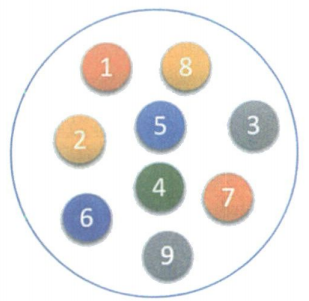
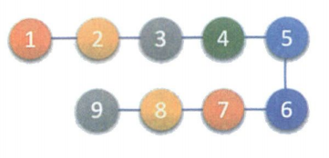
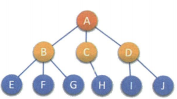
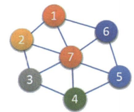
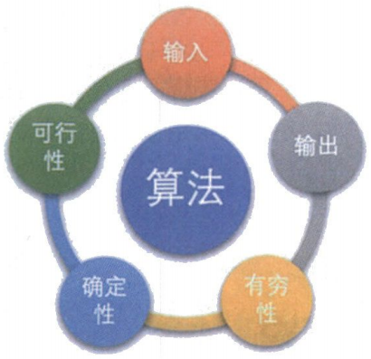
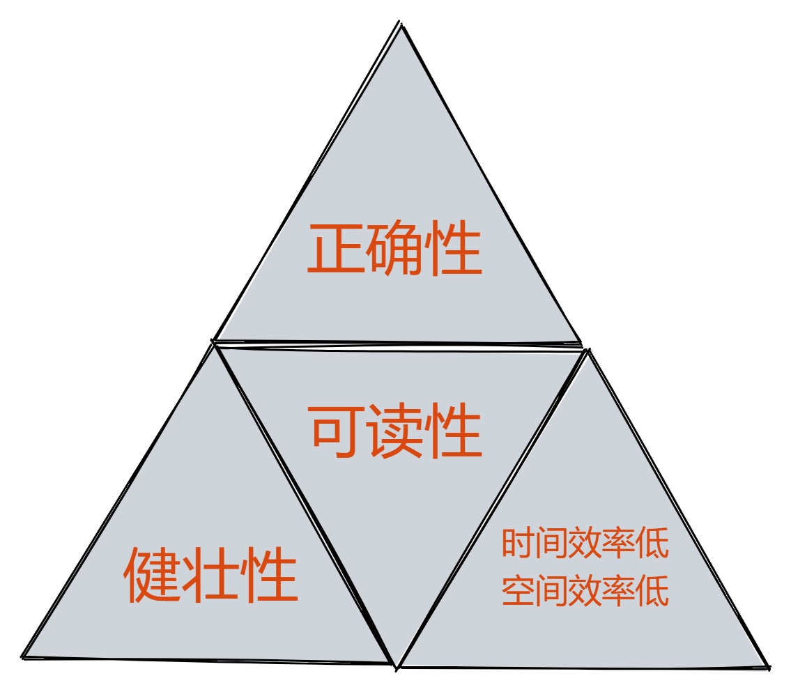
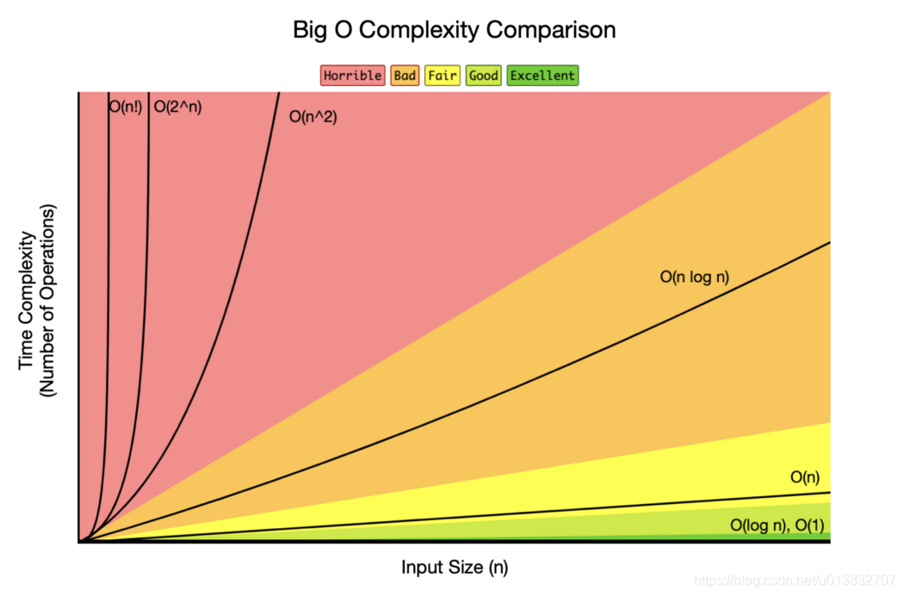

> 数据结构和算法是相互依赖不可分割的。
>
> 程序 = 数据结构 + 算法

# 一、数据结构

> 数据结构是一门研究非数值计算的程序设计问题中的操作对象，以及它们之间的关系和操作相关问题的学科。

## 1、基本概述和术语

**数据**：

> 是描述客观事物的符号，是计算机中可以操作的对象，是能被计算机识别，并输入给计算机处理的符号集合。

数据其实就是符号，比如数字和字符文字等数据，视频和音频都可以通过编码手段变成字符数据处理。

**数据元素：**

> 是组成数据的、具有一定意义的基本单位，在计算机中通常作为整体处理，也被称为记录。

上面说的数据更像是宏观层面说的，而数据元素是具体的，比如人类中人就是数据元素。

**数据项：**

> 一个数据元素可以由多个数据项组成。数据项是数据不可分的最小单位。

比如人有耳朵、鼻子、眼睛等数据项。在讨论问题时，通常数据元素才是数据结构中建立数据模型的着眼点。

**数据对象：**

> 是相同性质的数据元素的集合，是数据的子集。

实际应用中，处理的数据元素通常具有相同性质，研究数据结构其实就是研究数据对象的关系结构，通常数据对象简称为数据。

**数据结构：**

> 是相互之间存在一种或多种特定关系的数据元素的集合。

不同数据元素之间不是独立的，而是存在特定的关系，我们将这些关系称为结构。个人理解：*数据结构* = *数据对象的关系结构*

## 2、逻辑结构和物理结构

**逻辑结构：**

> 是指数据对象中数据元素之间的相互关系。

逻辑结构分为以下四种：

1. 集合结构：集合结构中的数据元素除了同属于一个集合外，它们之间没有具他关系。

   

2. 线性结构：线性结构中的数据元素之间是一对一的关系。

   

3. 树形结构：树形结构中的数据元素之间存在一种一对多的层次关系。

   

4. 图形结构：图形结构的数据元素是多对多的关系。

   

**物理结构：**

> 是指数据的逻辑结构在计算机中的存储形式。

数据元素的存储结构形式有两种：顺序存储和链式存储。

1. 顺序存储结构：是把数据元素存放在地址连续的存储单元里，其数据间的逻辑关系和物理关系是一致的。
2. 链式存储结构：是把数据元素存放在任意的存储单元里，这组存储单元可以是连续的，也可以是不连续的。

## 3、数据类型

**数据类型：**

> 是指一组性质相同的值的集合及定义在此集合上的一些操作的总称。

**抽象数据类型：**

> 抽象数据类型（Abstract Date Type，ADT）：一个数学模型及定义在该模型上的一组操作。抽象数据类型的定义仅取决于它的一组逻辑特性，而与其在计算机内部如何 表示和实现无关。

# 二、算法

## 1、算法定义

> 算法是解决特定问题求解步骤的描述，在计算机中表现为指令的有限序列，并且每个指令表示一个或多个操作。

算法就是解决问题的方法。对于给定的问题，是可以有多种算法来解决的。有没有通用的算法呢？这个问题就好像有没有包治百病的药。

## 2、算法特征

算法有五个特征：输入、输出、有穷性、确定性、可行性。

1. **输入输出**：算法有零个或多个输入；算法至少有一个或多个输出。
2. **有穷性**：指算法在执行有限的步骤之后，自动结束而不会出现无限循环，并且每一个步骤在可接受的时间内完成。
3. **确定性**：算法的每一步骤都具有确定的含义，不会出现二义性。
4. **可行性**：算法的每一步都必须是可行的，也就是说，每一步都能够通过执行有限次数完成。

## 3、算法设计的要求

1. **正确性**：算法的正确性是指算法至少应该具有输入和输出和加工处理无歧义性，能正确反映问题的需求，能够得到问题的正确答案。

   但是算法的“正确”通常在用法上有很大的差别，大体分为以下四个层次。 
   （1）算法程序没有语法错误。
   （2）算法程序对于合法的输入数据能够产生满足要求的输出结果。
   （3）算法程序对于非法的输入数据能够得出满足规格说明的结果。
   （4）算法程序对于精心选择的,甚至刁难的测试数据都有满足要求的输出结果。

   一般情况下我们吧（3）作为一个算法是否正确的标准

2. **可读性：**算法设计的另一目的是为了便于阅读、理解和交流。

3. **健壮性：**输入数据不合法时，算法也能做出相关处理，而不是产生异常或莫名其妙的结果。

4. **时间效率高合存储量低：**设计算法应该尽量满足时间效率高和存储量低的需求。

## 4、算法效率

对算法效率的分析，一种方法是算平均时间复杂度。另一种方法是计算最坏时间复杂度。一般在没有特殊说明的情况下，复杂度都是指最坏时间复杂度。

**算法时间复杂度的定义：**

> 在进行算法分析时，语句总的执行次数T(n)是关于问题规模n的函数进而分析T(n)随n的变化情况并确定T(n)的数量级。算法的时间复杂度，也就是算法的时间量度，记作T(n) = O(f(n))。它表示随问题规模n的增大，算法执行时间的增长率和f(n)的增长率相同，称作算法的渐近时间复杂度，简称为时间复杂度。其中f(n)是问题规模n的某个函数。

**推导大O阶方法：**

> 推导大O阶：
> （1）用常数1取代运行时间中的所有加法常数。
> （2）在修改后的运行次数函数中，只保留最高阶顶。
> （3）如果最高阶项存在且其系数不星1，则去除与这个项相乘的系数。得到的结果就是大O阶。

**常见的时间复杂度：**

`O(1)  <  O(log n)  <  O(n)  <  O(nlogn)  <  O(n^2)  <  O(2ⁿ)  <  O(n!)`

**算法空间复杂度：**

> 算法的空间复杂度通过计算算法所需的存储空间实现，算法空间复杂度的计算公式记作：S(n)= O(f(n))，其中，n为问题的规模，f(n)为语句关于n所占存储空间的函数。

可以通过空间换取时间。

# 三、线性表

## 1、定义

> 线性表（List）：零个或多个数据元素的有限序列。

## 2、顺序存储结构

### ① 顺序表

> 线性表的顺序存储结构就是顺序表。通常高级语言中的数组来实现。

优点：

缺点：

### ② 静态链表

## 3、链式存储结构

### ① 单链表

### ② 双向链表

### ③ 循环链表

# 四、树

## 二叉树

### 1、定义

> 二叉树（Binary Tree）是n（n≥0）个结点的有限集合，该集合或者为空集（称为空二叉树），或者由一个根节点和两颗互不相交的、分别称为根节点的左子树和右子树的二叉树组成（左子树和右子树是有顺序的，不能颠倒）。

### 2、性质

**①** 二叉树第i层最多有$2^{i-1}$个结点（$i\geq1$）

**②** 二叉树深度为k，最多有$2^k-1$个结点 

**③** 二叉树度为0的节点数n~0~和度为2的节点数n~2~关系：$n_0=n_2+1$

**④** 二叉树总结点数为n，则深度为：$[log_2n]+1$（[x]为不大于x的最大整数）

**⑤** 完全二叉树总结点数为n，对其按层次从左到右编号，则对任意编号的结点$i$：

​		$[i/2]$    为该结点的父亲（前提是i结点不是编号1的根结点）

​		$2i$         为该结点的左孩子 （前提是它有左孩子，即$2i<n$）

​		$2i+1$  为该结点的右孩子 （前提是它有有孩子，即$2i+1<n$）

### 3、遍历

1. 前序遍历：根、左、右
2. 中序遍历：左、根、右
3. 后续遍历：左、右、根
4. 层序遍历：一层一层从左到右遍历
