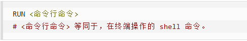
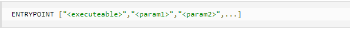

## 例子

Dockerfile文件

```dockerfile
FROM centos
MAINTAINER zzyy<zzyybs@126.com>

ENV MYPATH /usr/local
WORKDIR $MYPATH

#安装vim编辑器
RUN yum -y install vim
#安装ifconfig命令查看网络IP
RUN yum -y install net-tools
#安装java8及lib库
RUN yum -y install glibc.i686
RUN mkdir /usr/local/java
#ADD 是相对路径jar,把jdk-8u171-linux-x64.tar.gz添加到容器中,安装包必须要和Dockerfile文件在同一位置
ADD jdk-8u171-linux-x64.tar.gz /usr/local/java/
#配置java环境变量
ENV JAVA_HOME /usr/local/java/jdk1.8.0_171
ENV JRE_HOME $JAVA_HOME/jre
ENV CLASSPATH $JAVA_HOME/lib/dt.jar:$JAVA_HOME/lib/tools.jar:$JRE_HOME/lib:$CLASSPATH
ENV PATH $JAVA_HOME/bin:$PATH

EXPOSE 80

CMD echo $MYPATH
CMD echo "success--------------ok"
CMD /bin/bash
```

**构建**

docker build -t 新镜像名字:TAG .

```
docker build -t centosjava8:1.5 .
docker build  .  //不指定镜像名时，镜像为虚悬镜像
docker image prune //移除所有虚悬镜像
```


## 常用指令

**FROM**

基础镜像，当前新镜像是基于哪个镜像的，指定一个已经存在的镜像作为模板，第一条必须是from

**MAINTAINER**

镜像维护者的姓名和邮箱地址

**RUN**

容器构建时需要运行的命令

两种格式

1. shell格式



```
RUN yum -y install vim
```

1. exec格式


RUN是在 docker build时运行

**EXPOSE**

当前容器对外暴露出的端口

**WORKDIR**

指定在创建容器后，终端默认登陆的进来工作目录，一个落脚点

**USER**

指定该镜像以什么样的用户去执行，如果都不指定，默认是root

**ENV**

用来在构建镜像过程中设置环境变量

```
ENV MY_PATH /usr/mytest
```

这个环境变量可以在后续的任何RUN指令中使用，这就如同在命令前面指定了环境变量前缀一样；

也可以在其它指令中直接使用这些环境变量。

比如：`WORKDIR $MY_PATH`

**ADD**

将宿主机目录下的文件拷贝进镜像且会自动处理URL和解压tar压缩包

**COPY**

类似ADD，拷贝文件和目录到镜像中。

将从构建上下文目录中 <源路径> 的文件/目录复制到新的一层的镜像内的 <目标路径> 位置

```
COPY src dest
COPY ["src", "dest"]
```

<src源路径>：源文件或者源目录

<dest目标路径>：容器内的指定路径，该路径不用事先建好，路径不存在的话，会自动创建。

**VOLUME**

容器数据卷，用于数据保存和持久化工作

**CMD**

指定容器启动后的要干的事情


**注意：**

Dockerfile 中可以有多个 CMD 指令，但只有最后一个生效，CMD 会被 docker run 之后的参数替换。

参考官网Tomcat的dockerfile演示讲解：

官网最后一行命令


我们演示自己的覆盖操作


它和前面RUN命令的区别

- CMD是在docker run 时运行。
- RUN是在 docker build 时运行。

**ENTRYPOINT**

也是用来指定一个容器启动时要运行的命令

类似于 CMD 指令，但是ENTRYPOINT不会被docker run后面的命令覆盖， 而且这些命令行参数会被当作参数送给 ENTRYPOINT 指令指定的程序。

命令格式和案例说明

 命令格式：



ENTRYPOINT可以和CMD一起用，一般是变参才会使用 CMD ，这里的 CMD 等于是在给 ENTRYPOINT 传参。

当指定了ENTRYPOINT后，CMD的含义就发生了变化，不再是直接运行其命令而是将CMD的内容作为参数传递给ENTRYPOINT指令，他两个组合会变成

 

案例如下：假设已通过 Dockerfile 构建了 nginx:test 镜像：


优点：在执行docker run的时候可以指定 ENTRYPOINT 运行所需的参数。

注意：如果 Dockerfile 中如果存在多个 ENTRYPOINT 指令，仅最后一个生效。

**小总结**


## 